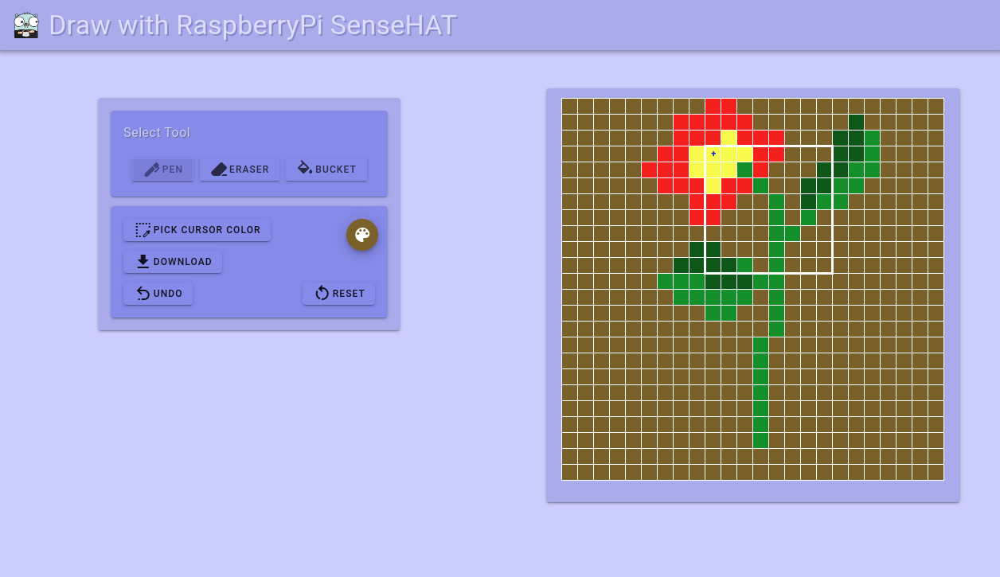

# PiHatDraw
The PiHatDraw is a learning project, to create a drwaing application to run with a Raspberry Pi with a
[Sense HAT](https://www.raspberrypi.org/products/sense-hat/), in the go programming language (goland). 

The Sense HAT contains an 8X8 LED display and a joystick. In this project, we're using the joystick to draw. 
The Sense HAT LED display is a floating window that shows a subset of the full picture. 

The full picture can be viewed using a web browser. The web display also contains some controllers, like changing the pen color and so on.

The application is written in golang. It's an event driven application. It uses webSockets to keep the web display in sync, and a web application to handle requests from the web client.

I wrote a blog post series with a tutorial to guide how to build this application.

For each post, there is a coresponding tag with the relevant code:
* [Introduction post](https://www.fungoprogramming.tech/2021/03/20/pihatdraw%e2%80%8a-%e2%80%8adraw-with-raspberry-pi-sense-hat-golang-and-websockets/)
* [Chapter 1: Start Drawing](https://www.fungoprogramming.tech/2021/03/20/pihatdraw-chapter-1-start-drawing/) - [v0.0.1](https://github.com/nunnatsa/piHatDraw/releases/tag/v0.0.1)
* [Chapter 2: Add Web-based display](https://www.fungoprogramming.tech/2021/03/23/pihatdraw-chapter-2-add-web-based-display-using-websockets/) - [v0.0.2](https://github.com/nunnatsa/piHatDraw/releases/tag/v0.0.2)
* [Chapter 3: Expand Canvas](https://www.fungoprogramming.tech/2021/03/25/pihatdraw-chapter-3-expand-canvas/) - [v0.0.3](https://github.com/nunnatsa/piHatDraw/releases/tag/v0.0.3)
* [Chapter 4: Adding Colors](https://www.fungoprogramming.tech/2021/04/06/pihatdraw-chapter-4-adding-colors/) - [v0.0.4](https://github.com/nunnatsa/piHatDraw/releases/tag/v0.0.4)
* [Chapter 5: Download the Picture](https://www.fungoprogramming.tech/2021/04/12/pihatdraw-chapter-5-download-the-picture/) - [v0.0.5](https://github.com/nunnatsa/piHatDraw/releases/tag/v0.0.5)
