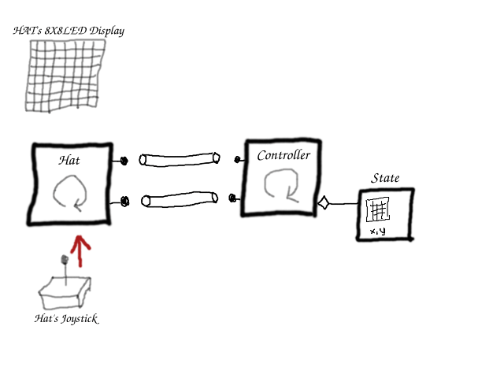

# Chapter 1: Start Drawing
This is the second post in the PiHatDraw series. In this post, we'll build a simple drawing application to run on a Raspberry Pi with a Sense HAT. We'll use the go programming language (or "golang"). If you didn't already, please read the [introduction post](index.md) to learn what we're are going to build and how to build the development environment.

## Getting the code
In this post, we will build the first phase of the piDrawHat application. If you like, you can download the code from here: https://github.com/nunnatsa/piHatDraw/releases/tag/v0.0.1

## Initiate the Project
First, we need to initiate a new golang project. We'll use the go mod command for that. We'll name our application "piHatDraw". If you prefer another name, remember to use this name in all the places we'll write "piHatDraw".

In the Raspberry Pi terminal, create a new directory for the project and go there:

```shell
mkdir -p ~/go/src/piHatDraw
cd ~/go/src/piHatDraw
go mod init piHatDraw
```
This will create a new file named go.mod in your new directory. The content of the file should be something like this:

```
module piHatDraw

go 1.16
```

We are going to use the bobblehat package to communicate with the Sense HAT hardware. Let's get this package:
```shell
go get github.com/nathany/bobblehat
```
If all went well, the go.mod file was modified to include this package, and should be similar to the following:
```
module piHatDraw

go 1.16

require github.com/nathany/bobblehat v0.0.0-20170421151738-14b0d1b4643e // indirect
```

Common Definitions
We'll start from common definitions that will serve several packages. create a new directory with the name "common", and within this new directory, create a new go file. For example, datatypes.go

Some IDEs will add the `package common` line. In this case, skip this line.

Copy the following code into the new file, and save it:
```go
package common
 
const (
    // the Sense HAT display is 8X8 matrix
    WindowSize = 8 // line 5
)

// Color is the Color of one pixel in the Canvas
type Color bool // line 9
```
n line 5, we define the `WindowSize` constant. This is the size of the hardware display, and it can't be changed.

In line 9, we define the `Color` type. Since we're starting with a black and white drawing, we only need to know if a pixel is set or not. When we'll add colors, we'll change Color to be something else.

## The hat Package
The hat package is the abstraction layer that wraps the bobblehat package and customizes it for our needs. The main type in the hat package is the Hat type. It contains two channels: one for output, to report the joystick events, and one for input, to receive instructions to update the HAT display.

Add a new directory under the main project directory, and call it hat. Within this new directory, create a new file with the name hat.go, copy the following to the new file and save it:

```go
package hat

import (
    "log"

    "github.com/nathany/bobblehat/sense/screen"
    "github.com/nathany/bobblehat/sense/screen/color"
    "github.com/nathany/bobblehat/sense/stick"
    "piHatDraw/common"
)

type Interface interface { // line 12
    Start()
    Stop()
}

// The format of the HAT color is 16-bit: 5 MS bits are the red color, the middle 6 bits are
// green and the 5 LB bits are blue
// rrrrrggggggbbbbb
const (
    redColor   color.Color = 0b1111100000000000
    whiteColor color.Color = 0b1111111111111111
)

const defaultJoystickFile = "/dev/input/event0"

// Joystick events
type Event uint8 // line 28

const (
    Pressed Event = iota
    MoveUp
    MoveLeft
    MoveDown
    MoveRight
)

// HAT display events
type DisplayMessage struct { // line 39
    Screen  [][]common.Color
    CursorX uint8
    CursorY uint8
}

func NewDisplayMessage(mat [][]common.Color, x, y uint8) DisplayMessage { 
    return DisplayMessage{
        Screen:  mat,
        CursorX: x,
        CursorY: y,
    }
}

type Hat struct { // line 53
    events chan<- Event
    screen <-chan DisplayMessage
    done   chan bool
    input  *stick.Device
}

func NewHat(joystickEvents chan<- Event, screenEvents <-chan DisplayMessage) *Hat  {
    return &Hat{
        events: joystickEvents,
        screen: screenEvents,
        done:   make(chan bool),
    }
}

func (h *Hat) Start() { // line 68
    h.init()
    go h.do()
}

func (h *Hat) Stop() { // line 73 
    h.done <- true
}

func (h *Hat) init() { // line 77
    var err error
    h.input, err = stick.Open(defaultJoystickFile)
    if err != nil {
        log.Panic("can't open "+defaultJoystickFile, err)
    }
    
    if err = screen.Clear(); err != nil {
        log.Panic("can't clear the HAT display", err)
    }
}

func (h *Hat) do() { // line 89
    defer h.gracefulShutDown() // line 90

    for {
        select {
        case event := <-h.input.Events: // line 94
            switch event.Code {
            case stick.Enter:
                h.events <- Pressed
                log.Println("Joystick Event: Pressed")

            case stick.Up:
                h.events <- MoveUp
                log.Println("Joystick Event: MoveUp")

            case stick.Down:
                h.events <- MoveDown
                log.Println("Joystick Event: MoveDown")

            case stick.Left:
                h.events <- MoveLeft
                log.Println("Joystick Event: MoveLeft")

            case stick.Right:
                h.events <- MoveRight
                log.Println("Joystick Event: MoveRight")
            }

        case screenChange := <-h.screen: // line 117
            h.drawScreen(screenChange)

        case <-h.done: // line 120
            return
        }
    }
}

func (h *Hat) drawScreen(screenChange DisplayMessage) { // line 126
    fb := screen.NewFrameBuffer()
    for y := 0; y < 8; y++ {
        for x := 0; x < 8; x++ {
            if screenChange.Screen[y][x] {
                fb.SetPixel(x, y, whiteColor)
            }
        }
    }
    
    fb.SetPixel(int(screenChange.CursorX), int(screenChange.CursorY), redColor)
    err := screen.Draw(fb)
    if err != nil {
        log.Println("error while printing to HAT display:", err)
    }
}

func (h Hat) gracefulShutDown() {
    screen.Clear()
    // signal the controller we've done
    close(h.events)
}
```
In line 12, we are defining an interface for the Hat type. This will allow using a mock in unit tests.

In lines 28 – 36, we define the joystick events. `iota` is a special command in go, that sets a series of constants with a running number, starting from 0. So Pressed is 0, MoveUp is 1 and MoveRight is 4. These are the events that will be sent from the hat to the receiver, for handling.

In line 39, we define the `DisplayMessage` type. This type is the message sent to the Hat in order to update the display. It contains the 8X8 matrix of pixels and the location of the cursor.

In line 53, we define the main type of the package, the `Hat` type. It's a struct that holds two channels, the `events` output channel and the `screen` input channel. The `input` field is the hardware representation from the bobblehat package. We will get the hardware joystick events from it. The `done` channel will help us for a graceful shutdown.

The `Hat.Start` function in line 68, implements the `hat.Interface`. It initializes the hardware and then calls the `do` function as a new goroutine.

In line 73, we have the `hat.Stop` function, that also implements the `hat.Interface` `Stop` function. It closes the `done` channel, and as we'll see soon, it will cause exit from the main loop of the package in the `do` function. We need to use a channel because this loop is running in its own goroutine.

The `init` function in line 77 setups the hardware.

The `do` function in line 89, implements the main logic of the Hat type. It's an endless loop that runs in a goroutine (from the Hat.Start function).

First (line 90) we're using the `defer` command to call the `gracefulShutDown` function, so no matter what will happen, when we'll exit the `do` function, the `gracefulShutDown` function will be called.

We're using the go `select` command to get and handle each event separately. It also promises that we won't get another event while handling another one.

There are three cases in this select. One is receiving events from the hardware joystick channel (line 94) and translates it to our event type, then sends the translated event to the output channel. The second case (line 117) receives display change events from the screen input channel and updates the HAT display. The third select case (line 120), is triggered when the done channel is closed. That happens when we're calling the stop function, as we saw earlier.

The `drawScreen` function (line 126), as its name suggests, updates the HAT display according to the content of the display message. First, in a new frame buffer (from the `bobblehat` package), we set all the pixels that are set in the message matrix. We set them to white. Then, we override the pixel in the cursor location to red.

And finally, the `gracefulShutDown` function, that called when we're closing the application, clears the HAT display and closes the `events` channel. As we'll see later, when we'll talk about the controller package, this signals the controller that the HAT is ready for shutdown, after we turned off the display.

## The Application State
It is possible to make changes directly on the Sense HAT display, each time we move or press the HAT joystick. It will work, but we have bigger plans than that. For example, we want to add a cursor. when the cursor moves, we need to set the original location to what was there before the cursor. That can't be done if we won't have a state. Also, in the next chapter, we will extract the canvas beyond the HAT display.

We want to store the picture pixel state (set or not) and the location of the cursor. Add a new directory under the main project directory, and call it state. Within this new directory, create a new file with the name state.go, copy the following to the new file and save it:

```go
package state

import (
    "log"

    "piHatDraw/hat"

    "piHatDraw/common"
)
 
const (
    canvasHeight = common.WindowSize
    canvasWidth  = common.WindowSize
)

type canvas [][]common.Color

type cursor struct {
    X, Y uint8
}

type State struct {
    Canvas canvas
    Cursor cursor
}

func NewState() *State {
    c := make([][]common.Color, canvasHeight)
    for y := 0; y < canvasHeight; y++ {
        c[y] = make([]common.Color, canvasWidth)
    }

    return &State{
        Canvas: c,
        Cursor: cursor{X: canvasWidth / 2, Y: canvasHeight / 2},
    }
}

func (s *State) GoUp() bool {
    if s.Cursor.Y > 0 {
        s.Cursor.Y--
        return true
    }
    return false
}

func (s *State) GoLeft() bool {
    if s.Cursor.X > 0 {
        s.Cursor.X--
        return true
    }
    return false
}

func (s *State) GoDown() bool {
    if s.Cursor.Y < canvasHeight-1 {
        s.Cursor.Y++
        return true
    }

    return false
}

func (s *State) GoRight() bool {
    if s.Cursor.X < canvasWidth-1 {
        s.Cursor.X++
        return true
    }

    return false
}

func (s *State) PaintPixel() bool {
    if s.Cursor.Y >= canvasHeight || s.Cursor.X >= canvasWidth {
        log.Printf("Error: Cursor (%d, %d) is out of canvas\n", s.Cursor.X, s.Cursor.Y)
        return false
    }
    
    if !s.Canvas[s.Cursor.Y][s.Cursor.X] {
        s.Canvas[s.Cursor.Y][s.Cursor.X] = true
        return true
    }
    return false
}

func (s State) CreateDisplayMessage() hat.DisplayMessage {
    c := make([][]common.Color, common.WindowSize)
    for y := 0; y < common.WindowSize; y++ {
        c[y] = make([]common.Color, 0, common.WindowSize)
        c[y] = append(c[y], s.Canvas[y]…)
    }

    return hat.NewDisplayMessage(c, s.Cursor.X, s.Cursor.Y)
}
```

In lines 12 and 13, we define the canvas size. Currently, it is the same as the window size, but we will change it in the third chapter.

We define the `canvas` type in line 16, to be a slice of Color slices. This is the canvas pixel matrix. The `cursor` type in line 18 is the location of the cursor.

The application state `State` in line 22 contains variables of these two types.

The `NewState` function in line 27, creates a new state instance, and initiates the matrix slices.

In lines 39 – 71, we have the moving functions (`GoUp`, `GoLeft`, `GoDown` and `GoRight`). Each one of these functions, updates the state's cursor location, making sure it does not exit the canvas boundaries. We don't return errors in such cases, we are just ignoring them. Errors will "make noise", we will need to check them and react to them, while the only thing that happened was that the user moved the joystick a bit more.

The `PaintPixel` function (line 73) sets the pixel under the cursor to true. This will later cause the display to draw this pixel.

All these five methods (the four move functions and the PaintPixel function) returns true if they modified the state, and false if they didn't.

## The controller
The `controller` package is the integration point. It receives events from the joystick and updates the state accordingly. It updates the display upon each change in the state.

Add a new directory under the main project directory, and call it controller. Within this new directory, create a new file with the name controller.go, copy the following to the new file and save it:
```go
package controller

import (
    "os"
    "os/signal"
    "syscall"

    "piHatDraw/hat"
    "piHatDraw/state"
)

type Controller struct {
    hat            hat.Interface
    joystickEvents chan hat.Event
    screenEvents   chan hat.DisplayMessage
    done           chan bool
    state          *state.State
}

func NewController() *Controller {
    je := make(chan hat.Event)
    se := make(chan hat.DisplayMessage)

    return &Controller{
        hat:            hat.NewHat(je, se),
        joystickEvents: je,
        screenEvents:   se,
        done:           make(chan bool),
        state:          state.NewState(),
    }
}

func (c Controller) Start() <-chan bool {
    go c.do()
    return c.done
}

func (c *Controller) do() {
    // Set up a signals channel (stop the loop using Ctrl-C)
    signals := make(chan os.Signal, 1)
    signal.Notify(signals, os.Interrupt, syscall.SIGTERM)

    defer c.stop(signals)
    
    c.hat.Start()

    msg := c.state.CreateDisplayMessage()
    c.screenEvents <- msg
    
    for {
        changed := false

        select {
        case <-signals:
            return
  
        case je := <-c.joystickEvents:
            switch je {
            case hat.MoveUp:
                changed = c.state.GoUp()

            case hat.MoveLeft:
                changed = c.state.GoLeft()

            case hat.MoveDown:
                changed = c.state.GoDown()

            case hat.MoveRight:
                changed = c.state.GoRight()

            case hat.Pressed:
                changed = c.state.PaintPixel()
            }
        }

        if changed {
            msg := c.state.CreateDisplayMessage()
            go func() {
                c.screenEvents <- msg
            }()
        }
    }
}

func (c *Controller) stop(signals chan os.Signal) {
    c.hat.Stop()
    <-c.joystickEvents // wait for the hat graceful shutdown
    signal.Stop(signals)
    close(c.done)
}
```

First, we define the `Controller` type (line 12). It contains the `Hat` and `State` instances, the `joystickEvents` and `screenEvents` channels, and the `done` channels that will respond to the application termination (CTRL+C), in order to kill the application.

The `NewController` function in line 20 populate all the fields and creates the event channels.

The `Start` function in line 33 is similar to the `Hat.Start` function. It runs the main logic as a goroutine and returns a channel. The caller can wait for this channel to be closed, as we'll see later in the main function.

The `do` function in line 38 is the main logic of the application. In lines 40-41, we are creating a channel and register it to the termination signal.

We are using the `defer` command in order to automatically call the stop function when the function will exit. The `stop` function implements the application grace shutdown. I mentioned the term "grace shutdown" before. The meaning is to perform a set of actions just before closing the application. For example, we want to turn off the HAT display before exiting the application.

Next, we're calling the Hat `Start` function. That will trigger the main loop of the hat package, as we saw earlier.

In lines 47 and 48, we're sending the initial state to the HAT display. The initial state contains no set pixel, but it does contain the initial location of the cursor. The result is that we now can see the cursor on the HAT display.

Then in line 50, we have the main loop of the controller. Again, we're using the select command to listen to events. The first event we're handling is the termination event in line 54. In this case, we are exiting the function. This will trigger the defer, which will call the `stop` function. Then, the goroutine is done and exit as well. We'll see soon what the `stop` function does.

The other event we're handling is the joystick event, in lines 57 – 73. This event is generated in the `Hat.do` function and here we're reading and handling it. For each joystick event, we are updating the state accordingly and checks the return value. If the state was changed, the return value will be true, and in this case, we're generating a display message and sending it to the Hat in the sceenEvents channel. The message contains a copy of the current state's canvas and the cursor location. As we saw earlier, this will cause the Hat to update its display.

Notice that we are sending the display message in a new goroutine. The reason for that is that while developing and testing the application, and before I put this code in a goroutine, the application sometimes froze. It happened because of a race condition: sending to a channel is a blocking action, so sending the display message here blocks the Controller.do function, until the Hat.do function will read it. If the Hat got a joystick event just before that, and sends the new event in the channel, it was also blocked, and we've got a deadlock. In the meantime, killing the application using CTRL+C didn't work, because this event is also handled in the do function and it was blocked. To prevent this deadlock, we're sending the display message in a goroutine.

The last function in this file is the `stop` function (line 85). This function is called by the `do` function on exit. It first closes the hat's `done` channel, causing the hat to clear its display, and to close the joystick event channel. in line 87 we're waiting for this channel to be close. If it is, we can continue because we know that the hat did its shutdown procedure – turning off the display. Next, we deregistering the termination signal and then closing the controller done channel. We'll see why in the `main` function.

## The PiHatDraw Application
We now have all the components set up and perform what they need to do. The only thing we need is a main function that will play it. Add a new file under the main project directory and call it main.go. Copy the following to the new file and save it.

```go
package main

import (
    "fmt"

    "piHatDraw/controller"
)

func main() {
    control := controller.NewController()
    <-control.Start()

    fmt.Println("\nGood Bye!")
}
```
That it! We are only creating a new `Controller`. That will build all the rest of the components. Then we start the controller. The controller returns its done channel. We just trying to read from it. This operation is blocking, so we won't exit the application yet. When the controller will close the done channel (in the `Contoller.stop` function), then the `main` function is no longer blocked and can exit the function – and the application.

## Summery
Let's summarize by following an event. The user moves up the physical joystick on the Sense HAT. The driver catches it and pushes an event to its channel. The select loop in the Hat's do function reads the hardware event, converts it to a simpler MoveUp event, and pushes it to the joystick event channel. The select loop in the Controller's do function catches the MoveUp event. First, it updates the state with the change, causing a change in the state's cursor location. Then, it uses the current state to build a display message and pushes it to the display channel. Now, the Hat's select loop catches the display message, prepares the driver's frame buffer, and updates the driver with the new display. The driver updates the physical display and now it matches the application state.



This whole mess is too complex for what we've got by now. We could build a much simpler application and achieve the same behavior by setting the display directly upon a joystick event, with no channels, no goroutines, no controller, and no state. The reason for this complexity is that we want more from this application. This architecture opens many possibilities that we will use in the coming posts. The main advantage of this architecture is that we now have a source of truth – the application state, and an integration point – the controller. We are going to have multiple displays by adding web-based displays, to expand the picture size beyond the HAT's 8X8 limited display, to add colors, to allow reset, and to suggest downloading the picture as a file.

## Building and Running
To build the piHatDraw application, use the terminal again, from the project directory (e.g. ~/go/src/piHatDraw) in the Raspberry Pi. The build command is simple:
```shell
go build .
```
The project directory should now include a new file named piHatDraw with no extension. To run it, just type in the terminal:
```shell
./pyHatDraw
```
If we did everything right, one LED is light in red in the middle of the HAT display – this is the cursor. Go on and move the joystick. You should see the cursor move. Press the joystick and move again, and notice that the previous location of the cursor is now white. You can try to draw a simple picture.

To turn the application off, use **CTRL+C** in the terminal that run it.

It wasn't short but I hope you enjoy it. Please use the comment, ask questions or argue. I'll be glad to make this tutorial and the application better.

In the [next post](ch2.md) we'll add a web based display, to be sync with the Sense HAT display.

