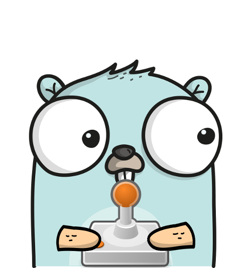

# PiHatDraw – Chapter 1: Start Drawing
This is the second post in the PiHatDraw series. In this post, we’ll build a simple drawing application to run on a Raspberry Pi with a Sense HAT. We’ll use the go programming language (or “golang”). If you didn’t already, please read the [introduction post](introduction.md) to learn what we’re are going to build and how to build the development environment.

## Getting the code
In this post, we will build the first phase of the piDrawHat application. If you like, you can download the code from here: https://github.com/nunnatsa/piHatDraw/releases/tag/v0.0.1

## Initiate the Project
First, we need to initiate a new golang project. We’ll use the go mod command for that. We’ll name our application “piHatDraw”. If you prefer another name, remember to use this name in all the places we’ll write “piHatDraw”.

In the Raspberry Pi terminal, create a new directory for the project and go there:

```shell
mkdir -p ~/go/src/piHatDraw
cd ~/go/src/piHatDraw
go mod init piHatDraw
```
This will create a new file named go.mod in your new directory. The content of the file should be something like this:

```
module piHatDraw

go 1.16
```

We are going to use the bobblehat package to communicate with the Sense HAT hardware. Let’s get this package:
```shell
go get github.com/nathany/bobblehat
```
If all went well, the go.mod file was modified to include this package, and should be similar to the following:
```
module piHatDraw

go 1.16

require github.com/nathany/bobblehat v0.0.0-20170421151738-14b0d1b4643e // indirect
```

Common Definitions
We’ll start from common definitions that will serve several packages. create a new directory with the name “common”, and within this new directory, create a new go file. For example, datatypes.go

Some IDEs will add the package common line. In this case, skip this line.

Copy the following code into the new file, and save it:
```go 
package common
 
const (
    // the Sense HAT display is 8X8 matrix
    WindowSize = 8
)

// Color is the Color of one pixel in the Canvas
type Color bool
```
n line 5, we define the WindowSize constant. This is the size of the hardware display, and it can’t be changed.

In line 9, we define the Color type. Since we’re starting with a black and white drawing, we only need to know if a pixel is set or not. When we’ll add colors, we’ll change Color to be something else.