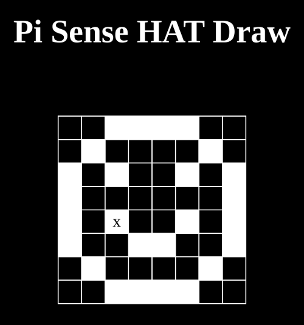
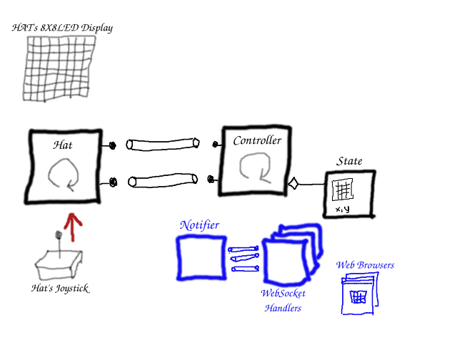

# Chapter 2: Add Web-based display Using WebSockets

This is the third post in the piHatDraw series. In the [previous post](ch1), we built the first phase of the PiHatDraw application. The application used the Sense HAT joystick to draw a black and white picture on the Sense HAT 8X8 LED display. In this post, we going to add the ability to see the piHatDraw picture on a web browser, in addition to the Sense HAT LED display. The web display can be displayed simultaneously in several web browsers.

We are going to add an HTTP server to PiHatDraw and turn it into a web application. We will have a web page with some javascript, and a new package in piHatDraw to implement the web application.

The web application will answer two HTTP requests: getting the HTML page and starting a WebSocket session.

We will also add an in-memory primitive publish-subscribe mechanism and use it to update the web clients.

## Getting the code
In this post, we will build the second phase of the PiDrawHat application. If you like, you can download the code from here: https://github.com/nunnatsa/piHatDraw/releases/tag/v0.0.2

## State Changes
We are not going to actually change the state in this chapter. However, we want to send the state to the web client as a json object. JSON is JavaScript Object Notation. It's a text-based data-interchange format. It is used by javascript to describe object, and became a very popular way to send data to web pages. In golang, we're using tags in order to let go json marshler know how to build the json representation of our state.

Edit the state/state.go, and find the cursor and the State types, and replace them with the following code.
```go
type cursor struct {
    X uint8 `json:"x"`
    Y uint8 `json:"y"`
 }
 type State struct {
     Canvas canvas `json:"canvas,omitempty"`
     Cursor cursor `json:"cursor,omitempty"`
 }
```
The field names start with upper case letters because they are exposed. But json fields should start with lower case letters. That why we need to add the json tags – because the fields name are not the same as the required json field names.

## Add Public-Subscribe Mechanism
We will have an unknown number of web clients that are going to connect and disconnect randomly. We want to update all of them with any change in the application state. For that, we will use the public-subscribe concept: any client that wants to get messages will dynamically subscribe to our public-subscribe mechanism. Now, when we'll want to broadcast a message to our subscribers, we do know them.

We will use a golang map, with a key of the subscriber Id; we will use a number for that. The value of the map will be a channel of byte slice. To subscribe, the client should send a channel, and receive back its subscriber ID.

Add a new notifier directory under the main project directory. Add a new notifier.go file under the new directory, and copy the following code to the new file:
```go
package notifier

import (
   "log"
   "sync"
   "sync/atomic"
)

type idProvider struct {
   counter uint64
}

func newIdProvider() *idProvider {
   return &idProvider{
      counter: 0,
   }
}

func (p *idProvider) getNextID() uint64 {
   return atomic.AddUint64(&p.counter, 1)
}

type Notifier struct {
   clientMap map[uint64]chan []byte
   idp       *idProvider
   lock      *sync.Mutex
}

func NewNotifier() *Notifier {
   return &Notifier{
      clientMap: make(map[uint64]chan []byte),
      idp:       newIdProvider(),
      lock:      &sync.Mutex{},
   }
}

func (n *Notifier) Subscribe(ch chan []byte) uint64 {
   id := n.idp.getNextID()
   n.lock.Lock()
   n.clientMap[id] = ch
   n.lock.Unlock()

   log.Println("register new client", id)

   return id
}

func (n *Notifier) Unsubscribe(id uint64) {
   log.Println("deregister client", id)
   if ch, ok := n.clientMap[id]; ok {
      n.lock.Lock()
      delete(n.clientMap, id)
      n.lock.Unlock()
      close(ch)
   }
}

func (n *Notifier) NotifyAll(data []byte) {
   for id, subscriber := range n.clientMap {
      go n.sendToSubscriber(id, subscriber, data)
   }
}

func (n *Notifier) NotifyOne(id uint64, data []byte) {
   if subscriber, ok := n.clientMap[id]; ok {
      go n.sendToSubscriber(id, subscriber, data)
   } else {
      log.Printf("subscriber id %d was not found", id)
   }
}

func (n Notifier) sendToSubscriber(subID uint64, subscriber chan<- []byte, data []byte) {
   subscriber <- data
}
```
First, we define the `idProvider` type, in line 9. In line 19 we have the `getNextID` function. This function uses the `sync/atomic` package to increase the counter safely. That way we promise that the subscriber IDs will be unique.

 _This is a good place to mention that our application holds its state in memory. This is a bad practice in web applications, because they are usually running in multiple instances, and must store their state in external mechanism such as a database or a shared cache. In our case, we know that we'll always run as a single instance because the whole point is to run from a single Raspberry Pi._

The `Notifier` type in line 23 is our publish-subscribe implementation. The clients are stored as a channel of byte slices, in the `clientMap` field. The idp field is an instance of the `idProvider` type. We'll use it to generate the client IDs. The lock field is a mutex that will allow us to safely modify the map even if to clients are registered or de-register at the same time.

The `Subscribe` function in line 37 will be called by the client to subscribe to the notifier. We're generating a unique ID for our subscriber, then locking the mutex to protect the map. If the mutex is already locked, the function is blocked until the mutex is unlocked. Now we can safely add the new subscriber to the map, and then we can unlock the mutex, letting other clients subscribe to the notifier. At the end of the function, we return the new ID to the client.

The `Unsubscribe` function in line 48 is mostly the same as the `Subscribe` function, except that we deleting a subscriber by its ID, instead of adding it. We are also closing the subscriber channel.

Next, in the `NotifyAll` function (line 58), we are going over the map and sending the same message to all the subscribers. We are calling the `sendToSubscriber` function in a new goroutine to prevent a deadlock. The `NotifyOne` function (line 64) allows us to send a message to a specific client. We will use it during subscription requests, to update the new subscriber with the current state; otherwise, the client will have to wait for the next change in the state, and until then, it wouldn't be able to display anything.

The actual sending to the subscriber is done in the `sendToSubscriber` function.

## The Web Application
The web application is built from two parts: the frontend – the code that runs in the web browser, and the backend – the code that is running in the server and handles the web-client requests. There is one special case that may be a bit confusing: the request for the frontend code, for example, the HTML, CSS, or javascript files. This is a request from the web-client to the server that returns the client code.

Our web application uses WebSockets – we'll open a WebSocket connection from the web browser to the server, and keep it open. The server is sending messages to the client each time the application state is changing.

We will use the `gorilla/websocket` package in order to implement the server-side of this functionality. First, we'll get this package. Run the following command in the Raspberry Pi terminal, from the main directory of the piHatDraw project:

```shell
go get github.com/gorilla/websocket 
```
The Frontend
Let's start from the frontend – the client code that will run on the web browser. Create a new webapp directory under the project main directory. Create a new index.gohtml file under the new directory and copy the following code to new file:

```html
<!DOCTYPE html>
<html lang="en">
<head>
    <meta charset="UTF-8">
    <title>RPiDraw</title>
    <style>
        html {
            color: white;
            background: black;
        }
        table, td, th {
            border: 1px solid white;
        }

        td {
            text-align:center;
            vertical-align:middle
        }

        table {
            border-collapse: collapse;
            padding: 0;
            margin: auto;
        }

        div#table_wrapper {
            margin: auto;
            padding: 0;
        }

        div#main {
            margin: auto;
            padding-left: 0;
            padding-right: 0;
        }

        h1 {
            text-align: center;
            margin-bottom: 2em;
        }

        td {
            width: 20px;
            height: 20px;
        }
    </style>
</head>
<body>

<div id="main">
    <h1>Pi Sense HAT Draw</h1>
    <div id="table_wrapper">
        <table id="matrix">
        </table>
    </div>
</div>

<script type="text/javascript">

    let cursorID

    const socket = new WebSocket("ws://{{.Host}}:{{.Port}}/api/canvas/register");
    socket.onmessage = function (e) {
        const data = JSON.parse(e.data)
        console.log(`Received new canvas: ${e.data}`)
        let mt = document.getElementById("matrix")
        while (mt.lastElementChild) {
            mt.removeChild(mt.lastElementChild);
        }

        for ( let i = 0; i < data.canvas.length; i++ ) {
            let line = data.canvas[i]
            let tr = document.createElement("tr")
            for (let j = 0; j < line.length; j++) {
                let cell = line[j]
                let td = document.createElement("td")
                td.id = getCelId(j, i)
                if ( cell ) {
                    td.style.backgroundColor = "#ffffff"
                }

                tr.appendChild(td)
            }
            mt.appendChild(tr)
        }

        cursorID = getCelId(data.cursor.x, data.cursor.y)
        const cursorElement = document.getElementById(cursorID)
        cursorElement.style.color = reverseColor(cursorElement.style.backgroundColor)
        cursorElement.innerText = 'x'
    }

    function getCelId(x, y) {
        return `${x}`.padStart(2, '0') + '_' + `${y}`.padStart(2, '0')
    }

    function reverseColor(bg) {
        const rx = /rgb\((\d+), (\d+), (\d+)\)/
        let colors = bg.match(rx)
        if (!colors) {
            return 'rgb(255, 255, 255)'
        }

        const r = 255 - parseInt(colors[1])
        const g = 255 - parseInt(colors[1])
        const b = 255 - parseInt(colors[1])

        return `rgb(${r}, ${g}, ${b}`
    }
</script>
</body>
</html>
```
The gohtml file is a golang template for html files. The gohtml is not a formal extension, but some IDEs or their plugins know to read them as a mix of HTML and go template files, so it's a good choice for our file extension. We will mimic the Sense HAT display using a table. We will change the cells background color to set a pixel. We will write an ‘x' at the cursor location.

We placed an empty table in line 53. We'll populate this table dynamically using javascript. Our script starts by creating the WebSocket (line 62). The `{{.Host}}:{{.Port}}` part is a golang template that our web application will fill on runtime.

In line 63, we set a callback function for the websocket `onmessage` event. This function will be called each time we'll send a message from our application, through the WebSocket, to the web browser. First, we're converting the text message into a javascript object (line 64), then we are removing everything from the table. Next (line 71) we are re-building the table, line by line, cell by cell, according to the message body. Each time we find a value true in the message body, we set the background color of the related cell to white (#ffffff).

In line 87 we are setting the cursor. We set its color to be reverse of the cell background color, so we could see it both on set and unset cells.

## Serving the Index Page
Now we need to write a code that will return our HTML page when a web-browser is access our application URL. Add a new frontend.go file under the webapp directory, and copy the following code to the new file:
```go
webapp/frontend.go
package webapp

import (
   "bytes"
   "embed"
   "html/template"
   "log"
   "net/http"
   "os"
)

type indexPage []byte

func (ip indexPage) ServeHTTP(w http.ResponseWriter, _ *http.Request) {
   w.Header().Set("Content-Type", "text/html")
   _, err := w.Write(ip)
   if err != nil {
      log.Println(err)
   }
}

type indexPageParams struct {
   Host string
   Port uint16
}

//go:embed index.gohtml
var indexTemplate embed.FS

func newIndexPage(port uint16) indexPage {
   indexPageFs, err := template.ParseFS(indexTemplate, "*.gohtml")
   if err != nil {
      log.Panicf("Can't parse index page; %v", err)
   }

   hostname, err := os.Hostname()
   if err != nil {
      log.Panic(err)
   }

   hp := &indexPageParams{
      Host: hostname,
      Port: port,
   }

   buff := &bytes.Buffer{}
   if err = indexPageFs.Execute(buff, hp); err != nil {
      log.Panicf("Can't parse indexPage page; %v", err)
   }

   fmt.Printf("In your web browser, go to http://%s:%d\n", hostname, port)

   return buff.Bytes()
}
```
Templates in go are usually used to fill in up-to-date information from the server to the HTML page. We only need the Raspberry Pi hostname and our application port in order to build the WebSocket URL. These parameters won't be changed during the life of our application, so there is no point to re-build the page each time a web browser is connected. Instead, we can build the page when the application starts, and just send it each time we get a request for the index page.

We are using the brand new embedding feature of golang. This is why we need to use golang 1.16 or newer. The embedding feature allows us to add additional files to our application as part of the final binary. We don't need to make sure the files exist in some specific directory anymore.

In line 12 we're defining the indexPagetype as a slice of bytes. Then we implement the `net/http.Handler` interface by implementing the function. In this function, we are just sending the instance bytes to the client. We also set the `Content-Type` header to text/html to help the web browser process the response.

The `indexPageParams` type in line 22 is used to populate the template.

The comment in line 27 is a special comment. It notifies the go compiler to embed the `index.gohtml` file in the final application binary file. In line 28 we bind this file to the `indexTemplate` variable. Again, this is only supported from go version1.16 or newer.

The `newIndexPage` function in line 30, reads uses the new go 1.16 `embed.FS` type to load the template then populates the template parameter object (`indexPageParams`, lines 38-44) with the hostname and the port, generates the final index page into a byte buffer and returns the byte slice as an instance of `indexPage`.

## The Web Application and the WebSocket
In this section, we'll build the server side of our web application. We will have a single HTTP handler function that will respond to a WebSocket connection request. It will keep running until the connection is broken. It will use the notifier to register for display messages, and each time a display message arrived, the function will update its specific web client with the changes.

Create a new websocket.go file under the webapp directory, and copy the following code to the new file:
```go
package webapp

import (
   "log"
   "net/http"

   "github.com/gorilla/websocket"

   "piHatDraw/notifier"
)

var (
   upgrader = websocket.Upgrader{
      ReadBufferSize:  1500,
      WriteBufferSize: 1500,
   }
)

type ClientEvent interface{}

type ClientEventRegistered uint64

type WebApplication struct {
   mux          *http.ServeMux
   notifier     *notifier.Notifier
   clientEvents chan<- ClientEvent
}

func (ca WebApplication) GetMux() *http.ServeMux {
   return ca.mux
}

func NewWebApplication(mailbox *notifier.Notifier, port uint16, ch chan<- ClientEvent) *WebApplication {
   mux := http.NewServeMux()
   ca := &WebApplication{mux: mux, notifier: mailbox, clientEvents: ch}
   mux.Handle("/", newIndexPage(port))
   mux.HandleFunc("/api/canvas/register", ca.register)

   return ca
}

func (ca WebApplication) register(w http.ResponseWriter, r *http.Request) {
   if r.Method == http.MethodGet {
      conn, err := upgrader.Upgrade(w, r, nil) // error ignored for sake of simplicity
      if err != nil {
         log.Println("Error:", err)
         w.WriteHeader(500)
         _, _ = w.Write([]byte(err.Error()))

         return
      }

      defer conn.Close()

      subscription := make(chan []byte)

      id := ca.notifier.Subscribe(subscription)
      defer ca.notifier.Unsubscribe(id)
      ca.clientEvents <- ClientEventRegistered(id)

      for js := range subscription {
         log.Printf("got event; updating client %d\n", id)
         if err := conn.WriteMessage(websocket.TextMessage, js); err != nil {
            log.Printf("failed to send message to the client %d: %v\n", id, err)
            return
         }
      }
      log.Println("Connection is closed")
   } else {
      w.WriteHeader(http.StatusMethodNotAllowed)
   }
}
```
We're using the gorilla websocket package to implement the WebSocket. First, we create an `Upgrader` that will upgrade the regular HTTP connection to a WebSocket connection. WebSocket remains open to bi-directional communication, allowing the server to send messages back to the client.

We now define the `ClientEvent` type, that can be actually anything. We will use this type in order to send client requests to the controller. In this post, we will only have one type of client event – the `ClientEventRegistered` that will notify the controller that a new client registered. The content is the subscriber ID from the notifier, and will be used by the controller when it will handle this event.

The `WebApplication` type in line 23 is, as it's name suggested, the integration point of the web application. It contains three fields: the `mux` is a `http.Mux` that will be our request router – a map between URL paths and their handlers. The `notifier` field is the application notifier that will deliver display messages to the connected WebSockets, and the `clientEvents` field is a channel that is used to send client events through the web application, to the controller. We're using a channel here for two reasons. First, we can call a function directly from the controller object, because the controller imports the web application package, so the web application can't import the controller package. There are several ways to solve it – placing both of them in the same package, or use an interface in another package, like the common package. The second reason is that we want that the controller will handle each event to its end, and only then will be ready to receive a new event. This is because we want to protect the application state and to make sure that all the components are in sync.

The `WebApplication.register` function in line 42 implement the WebSocket logic, to syncronize the HAT display and the web-based display. It receives a `http.ResponseWriter` and a pointer to `http.Request` and returns nothing. That means that this function is a request handler. We'll get back to this soon.

Keep in mind that each time that a web client calls this function (by performing an HTTP request to its path), the function runs in its own goroutine. First, we're using the `Upgrater` variable to upgrade the HTTP connection to a WebSocket connection. In line 55, we're creating a channel of byte slice. This is the channel that will be used to get messages from the notifier. we are registering to the notifier with the new channel and receiving back our subscriber ID. We're using this ID in the defer line to de-register from the notifier. This function is going to run until the connection will be closed, and then we'll exit the function. That will trigger the defer and so this instance of the function will be deregistered from the notifier, so we won't waste our time trying to send messages to closed connections.

Now, all we need to do is to wait for new messages and send them as-is to the web-client through the open WebSocket (lines 61 – 67). If we failed to send the message, we assume that the WebSocket is closed, so we exit the function (triggering the defer).

Let's go back to line 33 – where we populate the mux with two requests the index page that will be called when the path is empty (/) and the register function that response to the `/api/canvas/register` path.

Changes in the Controller
We now want to modify our controller to update the web clients, each time the state is changing. Edit the controller/controller.go file. Add the following packages to the import block:

* encoding/json
* log
* piHatDraw/notifier
* piHatDraw/webapp

The final import block should be like this:
```go
import (
   "encoding/json"
   "log"
   "os"
   "os/signal"
   "syscall"

   "piHatDraw/notifier"
   "piHatDraw/webapp"

   "piHatDraw/hat"
   "piHatDraw/state"
)
```
Add two new fields to the controller type:

* `notifier *notifier.Notifier` – this will allow the controller to send a message to the web clients.
* `clientEvents <-chan webapp.ClientEvent` – this will allow the controller to receive events from the web clients.

The Controller type should now look like this:
```go
type Controller struct {
   hat            hat.Interface
   joystickEvents chan hat.Event
   screenEvents   chan hat.DisplayMessage
   done           chan bool
   state          *state.State
   notifier       *notifier.Notifier
   clientEvents   <-chan webapp.ClientEvent
}
```
We will also modify the `NewController` function to set these two new fields:
```go
func NewController(notifier *notifier.Notifier, clientEvents <-chan webapp.ClientEvent) *Controller {
   je := make(chan hat.Event)
   se := make(chan hat.DisplayMessage)

   return &Controller{
      hat:            hat.NewHat(je, se),
      joystickEvents: je,
      screenEvents:   se,
      done:           make(chan bool),
      state:          state.NewState(),
      notifier:       notifier,
      clientEvents:   clientEvents,
   }
}
```
Now, we'll change the do function to handle the web client events, and to notify the web client about any change in the application state.

First, we'll add the new event handler as a new case for the select sentence (don't confuse with the inner switch-case of the joystick event handling):
```go
case e := <-c.clientEvents:
   switch data := e.(type) {
   case webapp.ClientEventRegistered:
      id := uint64(data)
      c.registered(id)
   }
```
We are switching by the event message type. Currently, only the `ClientEventRegistered` is supported. In the web application, we are sending the notifier subscriber id as the client registration event. We are calling the new `Controller.registered` function (that we are going to write next), with the client's subscriber that we've got in the event body.

Now we want to change the code that handles state changes, so it will notify the web clients. We'll pack this handling in the new Controller.Update function that we'll write soon:
```go
if changed {
    c.Update()
}
```
The full do function should now look like this:
```go
func (c *Controller) do() {
   // Set up a signals channel (stop the loop using Ctrl-C)
   signals := make(chan os.Signal, 1)
   signal.Notify(signals, os.Interrupt, syscall.SIGTERM)

   defer c.stop(signals)

   c.hat.Start()

   msg := c.state.CreateDisplayMessage()
   c.screenEvents <- msg

   for {
      changed := false

      select {
      case <-signals:
         return

      case je := <-c.joystickEvents:
         switch je {
         case hat.MoveUp:
            changed = c.state.GoUp()

         case hat.MoveLeft:
            changed = c.state.GoLeft()

         case hat.MoveDown:
            changed = c.state.GoDown()

         case hat.MoveRight:
            changed = c.state.GoRight()

         case hat.Pressed:
            changed = c.state.PaintPixel()
         }

      case e := <-c.clientEvents:
         switch data := e.(type) {
         case webapp.ClientEventRegistered:
            id := uint64(data)
            c.registered(id)
         }
      }

      if changed {
         c.Update()
      }
   }
}
```
Let's write the Controller's registered function. It will update the new web application with the current state, so the web client would present the immediately after registration. The user experience will be that they get the current HAT picture when they open the index page, as it was part of the original page.
```go
func (c *Controller) registered(id uint64) {
    js, err := json.Marshal(c.state)
    if err != nil {
          log.Println(err)
    } else {
          c.notifier.NotifyOne(id, js)
    }
}
```
The function gets the subscriber ID so it can send a message only to the new client, and not by broadcast message. We modified the state package, adding json tags. Now we can use the json package to generate a the message content, using the Marshal function. The result is a slice of bytes that contains the json representation of the current state. Next we're using the notifier to send the new message to the new web client handler.

Now we'll write the Update function:
```go
func (c *Controller) Update() {
   msg := c.state.CreateDisplayMessage()
   go func() {
      c.screenEvents <- msg
   }()

   js, err := json.Marshal(c.state)
   if err != nil {
      log.Println(err)
   } else {
      c.notifier.NotifyAll(js)
   }
}
```
First, we're updating the HAT with the new state, as we did before. Then we are building the json representation of the state, as we did in the registered function. However, now we're using the notifier `NotifyAll` function because we want to update all our web clients.

## Changes in the main function
Now, we want to wrap it all from the main function. We will add a graceful shutdown handler, so when the controller exit, we'll turn off the web application and exit.

Replace the content of the main.go file with the following code:
```go
package main

import (
   "context"
   "fmt"
   "log"
   "net/http"

   "piHatDraw/notifier"
   "piHatDraw/webapp"

   "piHatDraw/controller"
)

func main() {

   n := notifier.NewNotifier()

   clientEvents := make(chan webapp.ClientEvent)
   webApplication := webapp.NewWebApplication(n, 8080, clientEvents)

   server := http.Server{Addr: ":8080", Handler: webApplication.GetMux()}

   control := controller.NewController(n, clientEvents)
   done := control.Start()
   go func() {
      <-done
      if err := server.Shutdown(context.Background()); err != nil {
         log.Fatalf("Failed to shutdown the server; %v", err)
      }
   }()

   if err := server.ListenAndServe(); err != http.ErrServerClosed {
      log.Panic(err)
   } else {
      fmt.Println("\nGood Bye!")
   }

}
```
In lines 17 – 20 we are creating a new notifier instance and a new web events channel, and creating a new WebApplication instance with them. We also send them to the `NewControoller` function in line 24, so the web application and the controller are now connected. The connection from the controller is done by the notifier, and the connection to the controller is done using the `clientEvents` channel.

In line 22, we have the server variable, that is a `http.Server` that response to port 8080. The handler is the webapp mux, that already defined with the path and their handlers. We want to stop it and exit the application when the controller exit it's `do` function. As we did in the previous post, we are waiting for the this to happen by reading from the done channel that we've got from the `Controller.Start` function. However, the `server.ListenAndServe` function is blocking, so we need to do that in a new goroutine (lines 26 – 31). When the controller is done, it closes its done channel and then we can shutdown the server.

In line 33, we're starting the server. As we said before, this is a blocking operation. When it will be done, we'll get an error. If the server stopped as a result of our shut done in line 28, the the error that the server returns is `http.ErrServerClosed`, so in this case, we can exit normally with a nice "Good Bye" message.

## Summary
In this post, we expanded the application functionality to also suggest a web-based display of the picture. We added two HTTP request handling. The first one just returns our index page. The second one upgrades the HTTP connection to a WebSocket connection and register to the notifier. Then it sends the subscriber ID it got from the registration to the controller. The controller builds a json message of the application state and sends it to the new WebSocket handler, which then sends it as-is to the web-client through the open WebSocket. The web client reacts to this message by drawing a table from the json message.

Let's follow again a joystick event. As before, the joystick event reaches the controller that in turn, updates the state. Then the controller build the HAT display message and sends it to the HAT to update its LED display. After that, the controller builds the json message and broadcast it to all the web clients using the notifier. For the WebSocket handler, and later for the web client, this is exactly as before: the handler sends the message to the web client, and the web client re-build the table.



## Building and Running
To build the piHatDraw application, use the terminal again, from the project directory (e.g. ~/go/src/piHatDraw) in the Raspberry Pi. The build command is simple (don't forget the dot):
```shell
go build .
```
The project directory should now include a new file named piHatDraw with no extension. To run it, just type in the terminal:

```shell
./pyHatDraw
```
If we did everything right, one LED is light in red in the middle of the HAT display – this is the cursor. In addition, you should see a printout in your terminal something like this:

In your web browser, go to `http://raspberrypi:8080`

Go on and move the joystick. You should see the cursor move. Press the joystick and move again, and notice that the previous location of the cursor is now white. You can try to draw a simple picture.

If you'll open the URL from the printout in your browser, you should see a matrix of 8X8 cells. The painting and the moving should be done simultaneously with the Sense HAT LED display.

To turn the application off, use **CTRL+C** in the terminal that run it.

It wasn't short but I hope you enjoy it. Please use the comment, ask questions or argue. I'll be glad to make this tutorial and the application better.

In the [next post](ch3.md), we'll expand the picture beyond the limit of the Sense HAT 8X8 display.