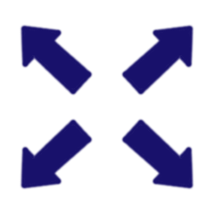

# Chapter 3: Expand Canvas
This is the fourth post in the PiHatDraw series. In the [previous post](ch2.md), we built the second phase of the PiHatDraw application. The application used the Sense HAT joystick to draw a black and white picture on the Sense HAT 8X8 LED display, and synchronized the display with a web display. In this post, we are going to expand the picture beyond the boundaries of the Sense HAT 8X8 LED display. The full picture can be only be viewed in a web browser, while the HAT display will be a floating window that will show a subset of the full picture.

In this post, we will change the application state to build a canvas with parametrized size. We will a window location field to the state, that will move with the cursor and represent the HAT 8X8 LED display. In the frontend, we don't need to change anything to display the larger picture, because it builds the picture directly from the json representation state. However, we want to present the HAT window by having a wider border around it. The change in the controller package is minor. We'll just use it to pass the required canvas size. In main.go, we will use the golang standard flag package to get the desired canvas size from the user, as well as the desired port, because sometimes ports are already in use.

## Getting the code
In this post, we will build the second phase of the PiDrawHat application. If you like, you can download the code from here: https://github.com/nunnatsa/piHatDraw/releases/tag/v0.0.3

## Changes in the state Package
We have relatively large number of changes in this package. Let's just replace the whole content of the `state/state.go` file with the following code, and then explain the differences:

```go
package state

import (
   "log"

   "github.com/nunnatsa/piHatDraw/hat"

   "github.com/nunnatsa/piHatDraw/common"
)

type canvas [][]common.Color

type cursor struct {
   X uint8 `json:"x"`
   Y uint8 `json:"y"`
}

type window struct {
   X uint8 `json:"x"`
   Y uint8 `json:"y"`
}

type State struct {
   Canvas       canvas `json:"canvas,omitempty"`
   Cursor       cursor `json:"cursor,omitempty"`
   Window       window `json:"window,omitempty"`
   canvasWidth  uint8
   canvasHeight uint8
}

func NewState(canvasWidth, canvasHeight uint8) *State {
   c := make([][]common.Color, canvasHeight)
   for y := uint8(0); y < canvasHeight; y++ {
      c[y] = make([]common.Color, canvasWidth)
   }

   cr := cursor{X: canvasWidth / 2, Y: canvasHeight / 2}
   halfWindow := uint8(common.WindowSize / 2)
   win := window{X: cr.X - halfWindow, Y: cr.Y - halfWindow}
   return &State{
      Canvas:       c,
      Cursor:       cr,
      Window:       win,
      canvasWidth:  canvasWidth,
      canvasHeight: canvasHeight,
   }
}

func (s *State) GoUp() bool {
   if s.Cursor.Y > 0 {
      s.Cursor.Y--
      if s.Cursor.Y < s.Window.Y {
         s.Window.Y = s.Cursor.Y
      }
      return true
   }
   return false
}

func (s *State) GoLeft() bool {
   if s.Cursor.X > 0 {
      s.Cursor.X--
      if s.Cursor.X < s.Window.X {
         s.Window.X = s.Cursor.X
      }
      return true
   }
   return false
}

func (s *State) GoDown() bool {
   if s.Cursor.Y < s.canvasHeight-1 {
      s.Cursor.Y++
      if s.Cursor.Y > s.Window.Y+common.WindowSize-1 {
         s.Window.Y++
      }
      return true
   }

   return false
}

func (s *State) GoRight() bool {
   if s.Cursor.X < s.canvasWidth-1 {
      s.Cursor.X++
      if s.Cursor.X > s.Window.X+common.WindowSize-1 {
         s.Window.X++
      }
      return true
   }

   return false
}

func (s *State) PaintPixel() bool {
   if s.Cursor.Y >= s.canvasHeight || s.Cursor.X >= s.canvasWidth {
      log.Printf("Error: Cursor (%d, %d) is out of canvas\n", s.Cursor.X, s.Cursor.Y)
      return false
   }
   if !s.Canvas[s.Cursor.Y][s.Cursor.X] {
      s.Canvas[s.Cursor.Y][s.Cursor.X] = true
      return true
   }

   return false
}

func (s State) CreateDisplayMessage() hat.DisplayMessage {
   c := make([][]common.Color, common.WindowSize)
   for y := uint8(0); y < common.WindowSize; y++ {
      c[y] = make([]common.Color, 0, common.WindowSize)
      c[y] = append(c[y], s.Canvas[s.Window.Y+y][s.Window.X:s.Window.X+common.WindowSize]...)
   }

   return hat.NewDisplayMessage(c, s.Cursor.X-s.Window.X, s.Cursor.Y-s.Window.Y)
}
```

We are removing the canvasHeight and canvasWidth constants. instead, we are creating them as new fields in the State type (lines 27 – 28). We're getting their value from the `NewState` function as parameters (line 31).

In line 18, we're adding the new window type. In line 43, we're adding the Window field of this type. The window is actually the location of the window's top-left corner. The size of the window is constant (8X8) and cannot be changed, so we don't need to store it. The initial location of the window is in the 4 pixels above, and 4 pixels left to the center of the canvas, so the center of the window, will be in the center of the window (lines 38-39).

Now, we are changing the location of the window in the moving functions (MoveUp, MoveDown, MoveLeft, and MoveRight). There are many behaviors we could use for the movement of the window. I implemented it like this: the cursor "pushes" the window to the canvas borders. for example, if the cursor moves from the initial position, the window won't move, because the initial location is in the middle of the window. Only when the cursor reaches the border of the window, the window will move with it. It's a bit easier to move left and up, because the window location is the upper left, so we don't need to compute where the window border is. The implementations of moving up and left are actually the same, here is how we're moving the window up:

```go
if s.Cursor.X > 0 {
   s.Cursor.X--
   if s.Cursor.X < s.Window.X {
      s.Window.X = s.Cursor.X
   }
   return true
}
```
So if the cursor passed the upper border of the window, we can just place them at the same vertical location (the value of the cursor's y).

When we're moving the cursor down or left, we need to the right or the bottom border. For example, here is how we're moving the window down:
```go
if s.Cursor.Y < s.canvasHeight-1 {
   s.Cursor.Y++
   if s.Cursor.Y > s.Window.Y+common.WindowSize-1 {
      s.Window.Y++
   }
   return true
}
```
We can set the window location to the cursor location in this case because they are not the same: the cursor is at the bottom border of the window, and the window vertical location its upper border.

Notice that we are not checking if the window exited the canvas borders because we are already checking it for the cursor, and that's enough in this implementation, because the cursor pushes the window from its border, and if the cursor got to one of the canvas borders, the corresponding window border is in the same place.

We are also modifying the CreateDisplayMessage function to copy the window instead of the whole canvas (line 112).

## The Controller Changes
The only change in the controller is to pass the canvas size from the NewController function and use it as parameters in the NewCanvas function call.

here is how the modified NewController looks like:
```go
func NewController(notifier *notifier.Notifier, clientEvents <-chan webapp.ClientEvent, canvasWidth uint8, canvasHeight uint8) *Controller {
   je := make(chan hat.Event)
   se := make(chan hat.DisplayMessage)

   return &Controller{
      hat:            hat.NewHat(je, se),
      joystickEvents: je,
      screenEvents:   se,
      done:           make(chan bool),
      state:          state.NewState(canvasWidth, canvasHeight),
      notifier:       notifier,
      clientEvents:   clientEvents,
   }
}
```
So we just adding the `canvasWidth`, `canvasHeight` function parameters (line 1) and use them as parameters when calling the `state.NewState` function in line 10.

## Changes in the Frontend
Since we added a json tag to the new Window field in the state.State type, the json will include it and we need to do nothing more to send this information to the web client. Also, since the web client does not know the picture size, but uses the canvas information from the canvas, we don't need to change anything in order to draw a larger picture in the web client.

In the webapp/index.gohtml file, find the line that contain this code (line 62):
```go
const socket = new WebSocket("ws://{{.Host}}:{{.Port}}/api/canvas/register");
```
Below this line, add this function:
```go
function markWindowBorders(i, j, td, win) {
    if (i === win.y) {
        if (j >= win.x && j <= win.x + 7) {
            td.style.borderTopWidth = "3px"
        }
    } else if (i === win.y + 7) {
        if (j >= win.x && j <= win.x + 7) {
            td.style.borderBottomWidth = "3px"
        }
    }

    if (j === win.x) {
        if (i >= win.y && i <= win.y + 7) {
            td.style.borderLeftWidth = "3px"
        }
    } else if (j === win.x + 7) {
        if (i >= win.y && i <= win.y + 7) {
            td.style.borderRightWidth = "3px"
        }
    }
}
```
In this function, we are looking at a specific table cell (our pixels are HTML table cells) and if it on the window border, we set the width of the relevant cell border to 3 instead of 1.

Now we'll add a call for this new function for each cell: search for the line with `tr.appendChild(td)` (originally, line 84). Add this code **_above_** this line:
```go
markWindowBorders(i, j, td, data.window);
```
## Change in the main function
Next, we're going to read some new program parameters from the command line using the golang standard package. In the main.go file, add "flag" to the import block. Then add the following var block, below the import block:

```go
var (
   canvasWidth, canvasHeight uint8
   port                      uint16
)
```

Now, add the init function below the new var block:
```go
func init() {
   var width, height, prt uint
   flag.UintVar(&width, "width", 24, "Canvas width in pixels")
   flag.UintVar(&height, "height", 24, "Canvas height in pixels")
   flag.UintVar(&prt, "port", 8080, "The application port")

   flag.Parse()

   if width < 8 {
      fmt.Println("The minimum width of the canvas is 8 pixels; setting it for you")
      width = 8
   }

   if width > 40 {
      log.Fatal("ERROR: The maximum width of the canvas is 40 pixels")
   }
   canvasWidth = uint8(width)

   if height < 8 {
      fmt.Println("The minimum height of the canvas is 8 pixels; setting it for you")
      height = 8
   }

   if height > 40 {
      log.Fatal("ERROR: The maximum height of the canvas is 40 pixels")
   }
   canvasHeight = uint8(height)

   port = uint16(prt)
}
```
`init()` is a special function in go. It called automatically before the main function is called. We're using init functions to set up the application before it starts. Int lines 2 – 5, we're reading the command line parameters. We defined 3 parameters:

* `-width` – changes the canvas width. The default value for this parameter if it missing is 24 pixels.
* `-height` – changes the canvas height. The default value for this parameter if it missing is 24 pixels.
* `-port` – the web application port. The default value for this parameter if it missing is 8080.

* We're using the `flag.UintVar` function to load the parameter values into local variables. All our parameters are unsigned ints, so we are using the same function from the flag package. This function also defines the default value and the description (the description is printed when sending the `-h` parameter when running the program).

calling `flag.Parse()` in line 7, doing the actual parameter processing, and populate the parameter variables (height, width and prt). Next we are validating the values:

In lines 9 – 12, we make sure the width is not less than the HAT width (8). If it is, we're forcing it to be 8. In lines 14 – 16 we make sure that the width is no more than 40. I didn't want to change make it larger because we're constantly sending the canvas content over the network. Also, I didn't want to get a picture larger than the web browser window. Both issues are manageable, but we won't solve them in this post. We are using the log.Fatal function to print the error because in this case, where the width is more than 40, we want to exit the application.

In line 17, we convert the value to int8 – so we could set the value of the cavnasWidth variable.

In lines 19 – 27, we're doing the same for the canvas height. and in line 29, we're setting the application port.

The next change is in the main function. We will use the port variable instead of the hard-coded 8080 port, and we will pass the `canvasWidth` and the `canvasHeight` variables to the `NewController` function, that will use it to create a new state. Here is the modified main function. Replace the current implementation with this one:
```go
func main() {
   n := notifier.NewNotifier()

   clientEvents := make(chan webapp.ClientEvent)
   webApplication := webapp.NewWebApplication(n, port, clientEvents)

   portStr := fmt.Sprintf(":%d", port)
   server := http.Server{Addr: portStr, Handler: webApplication.GetMux()}

   control := controller.NewController(n, clientEvents, canvasWidth, canvasHeight)
   done := control.Start()
   go func() {
      <-done
      if err := server.Shutdown(context.Background()); err != nil {
         log.Fatalf("Failed to shutdown the server; %v", err)
      }
   }()

   if err := server.ListenAndServe(); err != http.ErrServerClosed {
      log.Panic(err)
   } else {
      fmt.Println("\nGood Bye!")
   }

}
```
Notice that in line 7, we're building the port in format of :XXXX because this is the format that the server uses.

## Building and Running
To build the piHatDraw application, terminal again, from the project directory (e.g. ~/go/src/piHatDraw) in the Raspberry Pi. The build command is simple (don't forget the dot):

```shell
go build .
```
The project directory should now include a new file named piHatDraw with no extension. To run it, just type in the terminal:
```shell
./pyHatDraw
```
If we did everything right, one LED is light in red in the middle of the HAT display – this is the cursor. In addition, you should see a printout in your terminal something like this:
```shell
In your web browser, go to http://raspberrypi:8080
```
Open the URL from the printout in your browser, you should see a matrix of 24X24 cells. Notice the bold window in the middle of the picture. Now, start to move the joystick and press it to set a pixel. Notice that the window is moving along with the cursor and that if you moving the window to a place where you already draw, the HAT display will now show it. The HAT display is now a floating window that shows a subset of the larger picture.

Stop the application by pressing **CTRL+C** in the terminal that runs it. Now, run it with parameters. For example, let's use the maximal picture size, and use port 9090 instead of port 8080:

./piHatDraw -width=40 -height=40 -port=9090
Next, try to send wrong values, like width less than 8 or greater than 40.

In the [next post](ch4.md), we'll add colors, and practice some REST requests implementation.