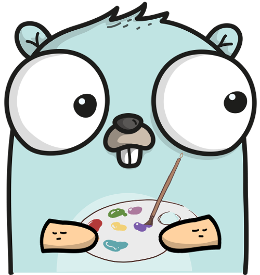
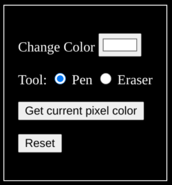

# Adding Colors
This is the fifth post in the PiHatDraw series. In the [previous post](ch3.md), we expanded the canvas beyond the boundaries of the Sense HAT's 8X8 LED display. In this post, we will add colors to our picture. We will practice golang REST handling and JSON marshaling and unmarshaling.

## Getting the Code
In this post, we will build the forth phase of the PiDrawHat application. If you like, you can download the code from here: https://github.com/nunnatsa/piHatDraw/releases/tag/v0.0.4

## What Are We Going to Do
In this post, we will change the type of our pixels from a Boolean value to a uint32 value, in order to represent 24-bit colors for each pixel. We will add a custom JSON conversion from and to the pixel data type. We will add new APIs to change the pen color; switch between a pen and an eraser, and reset the whole picture. We will add a control section in the web display to modify the current color, to peek the color from the current pixel, to switch the tool, and to reset the picture.

## Changing the State's Data Structure
The main change we want to do is to change the pixel's type from boolean to uint32. We'll start from the common/datatypes.go file. Add the following import block at the beginning of the file, below the package name:

```go
import (
    "encoding/json"
    "fmt"
 )
```
Then, change the Color type to uint32:
```go
type Color uint32
```
We're using uint32 to store the 24-bit color of a single pixel. We are not using the 8 most significant bits. Bits 0 – 7 (least significant bits) represent a value of 0 – 255 for the blue color. bits 8 – 15 are for the green color, and bits 16 – 23 are for the red color. The mix of these three colors gives us the final color. For example, if all the bits for the red color are set, and the green and the blue are zero, the hexadecimal value of the color will be 0xFF0000 and we get the red color. if all the bits are set (0xFFFFFF), we get white, and if no bit is set (0), then we get the black.

We're creating a JSON representation of the application state when we're updating the web clients. We will need to update the type we're using for the pixel colors, so the web client would able to use them. We will use the HTML color hex format for that, to ease the web client processing. The HTML color hex format is very similar to our implementation: it starts with a # charachter, then two hexadecimal digits for red, two for green and the last two are for the blue color. Two hexadecimal digits represent a single byte (values of 0 – 255) – exactly like our color. We'll now implement the `json.Marshaler` interface, so our Color type will get a custom JSON representation. Add the `MarshalJSON` function:
```go
func (c Color) MarshalJSON() ([]byte, error) {
   r := (c >> 16) & 0xFF
   g := (c >> 8) & 0xFF
   b := c & 0xFF

   s := fmt.Sprintf(`"#%02x%02x%02x"`, r, g, b)
   return []byte(s), nil
}
```
The `MarshalJSON` function is called automatically when we're using the json package to convert a `Color` instance to JSON representation. The function modifies the uint32 value to the HTML color hex format. In line 2, the function isolates the red color into the `r` variable. It does the same for the green (`g`, in line 3) and the blue (`b`, in line 4) colors. Now it just builds a string with the HTML format, using the `fmt.Springf` function (line 6) and returns it as a slice of bytes (line 7). Notice that we include the double quotes as part of the string because this is how strings are marked in JSON.

Next, we'll implement the `json.Unmarshaler` interface. We're doing that so we could get JSON requests from the web clients. We'll get to this later in this post. Add the `UnmarshalJSON` function:
```go
func (c *Color) UnmarshalJSON(bt []byte) error {
   var r, g, b uint32
   var s string
   err := json.Unmarshal(bt, &s)
   if err != nil {
      return err
   }

   _, err = fmt.Sscanf(s, `#%02x%02x%02x`, &r, &g, &b)
   if err != nil {
      return err
   }

   *c = Color(r<<16 | g<<8 | b)

   return nil
}
```
The `UnmarshalJSON` function does exactly the opposite from the `MarshalJSON` function: it gets color in HTML hex format and converts it to our Color type. This is happening when we unmarshal a JSON string to a golang type. First, we are reading the JSON token into the s variable, as a regular string (lines 3 – 7). Then we're using the `fmt.Sscanf` function to parse the HTML hex string into our r, g and b variables (lines 9 – 12). Finally, we update the color instance with the new value we combined from the red, green, and blue values (line 14).

We now want to change the state to use the colors. We will change the cursor to include a tool. The tool can be a pen – that paints in the current color, or an eraser, to delete the current pixel. Then could just select a tool that we want to use. We'll split the NewState function, moving most of its logic to the new Reset function, to allow clearing the whole picture.

In the `state/state.go` file, just under the Window type and above the State type (the order is not important, but for clarity and future references, I'm trying to keep the same order as in my code), add the tool interface:
```go
type tool interface {
   GetColor() common.Color
}
```
The tool contains a single function, that gets nothing and returns a Color instance. We will have two implementations of this interface. Add the pen type:
```go
type pen struct {
    Color common.Color `json:"color"`
}

func (p pen) GetColor() common.Color {
    return p.Color
}

func (p *pen) SetColor(c common.Color) {
    p.Color = c
}
```
The pen type only contains one field – the Color field. The `GetColor` function in line 5 is just a getter, but it also implements the `tool` interface. In line 9 we have the setter.

```go
type Eraser struct{}

func (Eraser) GetColor() common.Color {
   return 0
}
```
The Eraser is an empty struct. It holds no data. The `GetColor` function, implements the `tool` interface and always returns 0. 0 means black, since our canvas is black.
```go
type State struct {
   Canvas       canvas `json:"canvas,omitempty"`
   Cursor       cursor `json:"cursor,omitempty"`
   Window       window `json:"window,omitempty"`
   canvasWidth  uint8
   canvasHeight uint8
   ToolName     string `json:"tool"`
   Pen          *pen   `json:"pen"`
   tool         tool
}
```
It seems like we have three fields for the same thing, so no: The `ToolName` field will be used for the JSON representation of the state. The web client could present the right tool. The `Pen` field is used for the pen tool, but we want to store it as a separate field, so we could preserve the color while using the eraser. The `tool` field is the currently used tool. So sometimes we'll place the Pen there, and sometimes the eraser, and this is the tool that actually makes changes in the state.

```go
func NewState(canvasWidth, canvasHeight uint8) *State {
   s := &State{
      canvasWidth:  canvasWidth,
      canvasHeight: canvasHeight,
   }

   s.Reset()

   return s
}
```
The canvas size is not going to change, all the rest of the initialization work is done in the new Reset function. Let's add it:
```go
func (s *State) Reset() {
   c := make([][]common.Color, s.canvasHeight)
   for y := uint8(0); y < s.canvasHeight; y++ {
      c[y] = make([]common.Color, s.canvasWidth)
   }

   cr := cursor{X: s.canvasWidth / 2, Y: s.canvasHeight / 2}
   halfWindow := uint8(common.WindowSize / 2)
   win := window{X: cr.X - halfWindow, Y: cr.Y - halfWindow}

   s.Canvas = c
   s.Cursor = cr
   s.Window = win
   s.Pen = &pen{Color: 0xFFFFFF}
   s.SetPen()
}
```
We need to change the `PaintPixel` function a bit. Originally, we checked if a pixel is set or not before setting it. Now, we want to check if the pixel color was changes, and only update it if it there was a change. Here is new version of this function:
```go
func (s *State) PaintPixel() bool {
   if s.Cursor.Y >= s.canvasHeight || s.Cursor.X >= s.canvasWidth {
      log.Printf("Error: Cursor (%d, %d) is out of canvas\n", s.Cursor.X, s.Cursor.Y)
      return false
   }

   c := s.tool.GetColor()
   if s.Canvas[s.Cursor.Y][s.Cursor.X] != c {
      s.Canvas[s.Cursor.Y][s.Cursor.X] = c
      return true
   }

   return false
}
```
In line 7, we're getting the color from the tool. We don't know which tool is it, and we don't need to check each time if it's a pen or an eraser. We're using the interface, and so we can use the `GetColor` function to get the color. If we'll add a new tool in the future that will do something else, we need to change nothing in the PaintPixel implementation, as long as the GetColor function is implemented.

As before, we perform the change only if there was a change (lines 8 – 11), and we return true if we actually changed something in the state.

Now, add the `SetColor` function at the end of the file:
```go
func (s *State) SetColor(cl common.Color) bool {
   if s.Pen.GetColor() != cl {
      s.Pen.SetColor(cl)
      return true
   }
   return false
}
```
The function is kind of a proxy from the state to the Pen instance. I sets the Pen color.

The next function is the SetPen function. It set the tool to be the state Pen, and update the `ToolName` to "pen". Again, if the current tool is already a pen, the function will return false.
```go
func (s *State) SetPen() bool {
   s.tool = s.Pen
   if s.ToolName != "pen" {
      s.ToolName = "pen"
      return true
   }
   return false
}
```
Now, we'll define a package variable for the eraser:
```go
var eraser Eraser
```
The last function in state/state.go is the SetEraser function:
```go
func (s *State) SetEraser() bool {
   if s.ToolName != "eraser" {
      s.ToolName = "eraser"
      s.tool = eraser
      return true
   }
   return false
}
```
The SetEraser function set the tool to be the eraser, and set the ToolName to "eraser".

## Web Application Changes
Our state is ready to work with colors, but we can't even change the color. We will use the web application to do some modifications in the state, using HTTP requests. Later we'll add a control panel to our web display, but first, let's implement the HTTP API. Up until now, the web application supported two requests: getting the index page and initiating a WebSocket. We will add three new requests: changing the color, change the tool (pen or eraser), and reset the picture.

Open the `webapp/websocket.go` file. Add the following packages to the import block:

* "encoding/json"
* "fmt"
* "piHatDraw/common"

Just below the ClientEventRegistered type, add the three new client event types:
```go
type ClientEventSetColor common.Color

type ClientEventSetTool string

type ClientEventReset bool
```
These are the events that the web application will trigger, and will be consumed by the controller, to actually perform the requested change.

Now, let's add the first request handler – the set color handler:
```go
type setColorRq struct {
   Color common.Color `json:"color"`
}

func (ca WebApplication) setColor(w http.ResponseWriter, r *http.Request) {
   if r.Method == http.MethodPost {
      enc := json.NewDecoder(r.Body)
      msg := &setColorRq{}
      err := enc.Decode(msg)
      if err != nil {
         w.WriteHeader(http.StatusBadRequest)
         fmt.Fprint(w, `{"error": "can't parse json'"}`)
         return
      }

      log.Printf("Got set color request. Color = #%06x", msg.Color)

      clientEvent := ClientEventSetColor(msg.Color)
      ca.clientEvents <- clientEvent
   } else {
      w.WriteHeader(http.StatusMethodNotAllowed)
   }
}
```
First, we define the `setColorRq` type. We'll use this type in order to parse the request body, and use it as a go instance.

The `setColor` function is the request handler for changing the color. We only accept POST request. We are creating a JSON decoder to read from the request body and use it to populate the msg variable. Now we are creating a `ClientEventSetColor` instance – it's only an alias of the `common.Color` type – and send it to the `clientEvents` channel. The rest will be done by the controller.

Next, add two more request handlers. These handlers are very similar to the `setColor` handler. We'll define a request body type, read the body and send an event to the controller. The setTool request handler reads the tool name as a string and sends it as a `ClientEventSetTool` instance. The reset handler reads a Boolean value (not really necessary. it will always be `true`).
```go
type setToolRq struct {
   ToolName string `json:"toolName"`
}

func (ca WebApplication) setTool(w http.ResponseWriter, r *http.Request) {
   if r.Method == http.MethodPost {
      enc := json.NewDecoder(r.Body)
      msg := &setToolRq{}
      err := enc.Decode(msg)
      if err != nil {
         w.WriteHeader(http.StatusBadRequest)
         fmt.Fprint(w, `{"error": "can't parse json'"}`)
         return
      }

      log.Printf("Got set tool request. tool name = %v", msg.ToolName)

      clientEvent := ClientEventSetTool(msg.ToolName)
      ca.clientEvents <- clientEvent
   } else {
      w.WriteHeader(http.StatusMethodNotAllowed)
   }
}

type resetRq struct {
   Reset bool `json:"reset"`
}

func (ca WebApplication) reset(w http.ResponseWriter, r *http.Request) {
   if r.Method == http.MethodPost {
      enc := json.NewDecoder(r.Body)
      msg := &resetRq{}
      err := enc.Decode(msg)
      if err != nil {
         w.WriteHeader(http.StatusBadRequest)
         fmt.Fprint(w, `{"error": "can't parse json'"}`)
         return
      }

      if msg.Reset {
         log.Printf("Got reset request")
      }

      clientEvent := ClientEventReset(true)
      ca.clientEvents <- clientEvent
   } else {
      w.WriteHeader(http.StatusMethodNotAllowed)
   }
}
```
Now, when we have the new handlers, we'll add them to the mux. In the NewWebApplication function, add these lines just under the existing mux.HandleFunc("/api/canvas/register", ca.register) line:
```go
mux.HandleFunc("/api/canvas/color", ca.setColor)
mux.HandleFunc("/api/canvas/tool", ca.setTool)
mux.HandleFunc("/api/canvas/reset", ca.reset)
```
The final function should now look like this:
```go
func NewWebApplication(mailbox *notifier.Notifier, port uint16, ch chan<- ClientEvent) *WebApplication {
   mux := http.NewServeMux()
   ca := &WebApplication{mux: mux, notifier: mailbox, clientEvents: ch}
   mux.Handle("/", newIndexPage(port))
   mux.HandleFunc("/api/canvas/register", ca.register)
   mux.HandleFunc("/api/canvas/color", ca.setColor)
   mux.HandleFunc("/api/canvas/tool", ca.setTool)
   mux.HandleFunc("/api/canvas/reset", ca.reset)

   return ca
}
```
So now our state works with colors, and we have three new HTTP request handlers that allow the user to modify the color, change the tool and to reset the picture, but actually just notify the controller, so we need to add event handling for them in the controller. Open the `controller/controller.go` file. Add the `piHatDraw/common` package to the import block at the top of the file. Then we want to add the new event handlers to the do function. Here is the full function. The new lines to adds are lines 44 – 62.
```go
func (c *Controller) do() {
   // Set up a signals channel (stop the loop using Ctrl-C)
   signals := make(chan os.Signal, 1)
   signal.Notify(signals, os.Interrupt, syscall.SIGTERM)

   defer c.stop(signals)

   c.hat.Start()

   msg := c.state.CreateDisplayMessage()
   c.screenEvents <- msg

   for {
      changed := false

      select {
      case <-signals:
         return

      case je := <-c.joystickEvents:
         switch je {
         case hat.MoveUp:
            changed = c.state.GoUp()

         case hat.MoveLeft:
            changed = c.state.GoLeft()

         case hat.MoveDown:
            changed = c.state.GoDown()

         case hat.MoveRight:
            changed = c.state.GoRight()

         case hat.Pressed:
            changed = c.state.PaintPixel()
         }

      case e := <-c.clientEvents:
         switch data := e.(type) {
         case webapp.ClientEventRegistered:
            id := uint64(data)
            c.registered(id)

         case webapp.ClientEventReset:
            if data {
               c.state.Reset()
               changed = true
            }

         case webapp.ClientEventSetColor:
            color := common.Color(data)
            changed = c.state.SetColor(color)

         case webapp.ClientEventSetTool:
            switch string(data) {
            case "pen":
               changed = c.state.SetPen()
            case "eraser":
               changed = c.state.SetEraser()
            default:
               log.Printf(`unknown tool "%s"`, data)
            }
         }
      }

      if changed {
         c.Update()
      }
   }
}
```
We start from the `ClientEventReset` event in line 44. In this case, the data is a Boolean value. It's always true, but just in case, we're checking it (line 45). The handling is just to call the state's Reset function. This brings the state back to its initial state: it will delete all the pixels from the canvas, set the cursor and the window to the center of the canvas, set the pen color to white, and the tool to pen.

The next event we handle is the `ClientEventSetColor` event. The data, in this case, is a `common.Color` so we can use it to call the state's SetColor function. This function returns true if the color was actually modified. We're using the return value to update the clients. It maybe seems strange because the web client is the one that initiated the request to change the color (we'll do that on the next page), so the web client should already know the new color, right? Well, no. The specific client that made the change knows that, but if we have multiple web clients, this will update their color setting simultaneously. There is another reason for this that we'll see on the next page, but the main reason is that we keep using our design concept that the state is our source of truth, and we notify our clients with every change in the state.

The last event handling we added is the `ClientEventSetTool` event. The data here is a string. We support two tools: the pen and the eraser, so we'll call the `state.SetPen` function if the data is "pen" (lines 56 – 57), and the `state.SetEraser` function if the data is "eraser" (lines 58 – 59). We don't care about wrong values – we are just ignoring them (after logging them).

The Sense HAT display is an 8X8 LED display. The LEDs can't support the same number of colors as the web display. The 24-bit color format gives 16,777,216 colors, while the LED only supports 16-bit color, which gives only 65,536 colors. The HAT color scheme is RGB565, which means, the 5 most significant bits are for the red color, the next 6 bits are the green and the 5 least significant bits are the blue value.

We need a function to get a common.Color and translate it to RGB565. Open the hat/hat.go file. Remove the whiteColor constant and add the following constants to the const block (currently, it only contains the redColor constant).
```go
rmask    common.Color = 0b111110000000000000000000
gmask    common.Color = 0b000000001111110000000000
bmask    common.Color = 0b000000000000000011111000
```
The rmask is a 24-bit mask, where only the 5 most significant bits of the red color are set, the gmask is a 24-bit mask, where only the 6 most significant bits of the green color are set, and the bmask is a 24-bit mask, where only the 5 most significant bits of the blue color are set. The toHatColor function performs the conversion to RGB565:
```go
func toHatColor(c common.Color) color.Color {
   r := color.Color((c & rmask) >> 8)
   g := color.Color((c & gmask) >> 5)
   b := color.Color((c & bmask) >> 3)

   return r | g | b
}
```
For each color, we first isolate the color value by anding the color mask (rmask, gmask and bmask) with the color value, and then moving the isolated color to its new place in the RGB565 value. Now we have each color with the right set of bits in the right position, so we are just combining the three colors using OR operations.

The last change we need to do in hat/hat.go is to actually use the color when painting. In the drawScreen function, we have nested loops that go over the matrix of pixels and set them in the frame buffer. the current code looks like this:
```go
if screenChange.Screen[y][x] {
   fb.SetPixel(x, y, whiteColor)
}
```
Replace these three lines with this single line:
```go
fb.SetPixel(x, y, toHatColor(screenChange.Screen[y][x]))
```
That it. Now the HAT display uses colors.

## Change the Web Client
The web client code is in the webapp/index.gohtml file. We're going to make a lot of changes to this file, so I'll present the full file and explain the additions below.
```html
<!DOCTYPE html>
<html lang="en">
<head>
    <meta charset="UTF-8">
    <title>RPiDraw</title>
    <style>
        html {
            color: white;
            background: black;
        }
        table, td, th {
            border: 1px solid white;
        }

        td {
            text-align:center;
            vertical-align:middle
        }

        table {
            border-collapse: collapse;
            padding: 0;
            margin: auto;
        }

        div#table_wrapper {
            margin: auto;
            padding: 0;
        }

        div#main {
            margin: auto;
            padding-left: 0;
            padding-right: 0;
        }

        div#control {
            margin-top: 1em;
            border: 1px solid white;
            padding: 1em;
            width: fit-content;
            float: left;
            margin-right: 1em;
        }

        h1 {
            text-align: center;
            margin-bottom: 2em;
        }

        td {
            width: 20px;
            height: 20px;
        }
    </style>
</head>
<body>

<div id="main">
    <h1>Pi Sense HAT Draw</h1>
    <div id="control">
        <p>
            <label for="colorPicker">Change Color</label> <input type="color" id="colorPicker" value="#ffffff"/>
        </p>
        <p>Tool:
            <input type="radio" id="toolTypePen" name="toolType" value=true checked />
            <label for="toolTypePen">Pen</label>
            <input type="radio" id="toolTypeEraser" name="toolType" value=false />
            <label for="toolTypeEraser">Eraser</label>
        </p>
        <p>
            <input id="pickColorFromPixel" type="button" value="Get current pixel color">
        </p>
        <p>
            <input id="reset" type="button" value="Reset">
        </p>
    </div>
    <div id="table_wrapper">
        <table id="matrix">
        </table>
    </div>
</div>

<script src="https://ajax.googleapis.com/ajax/libs/jquery/3.5.1/jquery.min.js"></script>
<script type="text/javascript">

    let cursorID

    const socket = new WebSocket("ws://{{.Host}}:{{.Port}}/api/canvas/register");

    function markWindowBorders(i, j, td, win) {
        if (i === win.y) {
            if (j >= win.x && j <= win.x + 7) {
                td.style.borderTopWidth = "3px"
            }
        } else if (i === win.y + 7) {
            if (j >= win.x && j <= win.x + 7) {
                td.style.borderBottomWidth = "3px"
            }
        }

        if (j === win.x) {
            if (i >= win.y && i <= win.y + 7) {
                td.style.borderLeftWidth = "3px"
            }
        } else if (j === win.x + 7) {
            if (i >= win.y && i <= win.y + 7) {
                td.style.borderRightWidth = "3px"
            }
        }
    }

    socket.onmessage = function (e) {
        const data = JSON.parse(e.data)

        console.log(`Received new canvas: ${e.data}`)
        let mt = document.getElementById("matrix")
        while (mt.lastElementChild) {
            mt.removeChild(mt.lastElementChild);
        }

        for ( let i = 0; i < data.canvas.length; i++ ) {
            let line = data.canvas[i]
            let tr = document.createElement("tr")
            for (let j = 0; j < line.length; j++) {
                let cell = line[j]
                let td = document.createElement("td")
                td.id = getCelId(j, i)
                td.style.backgroundColor = cell

                markWindowBorders(i, j, td, data.window);

                tr.appendChild(td)
            }
            mt.appendChild(tr)
        }

        cursorID = getCelId(data.cursor.x, data.cursor.y)
        const cursorElement = document.getElementById(cursorID)
        cursorElement.style.color = reverseColor(cursorElement.style.backgroundColor)
        const tool = data.tool
        cursorElement.innerText = tool === "pen" ? '+' : tool === "eraser" ? 'x' : "?"

        if ( data.tool === "pen" ) {
            toolTypePen.checked = "checked"
        } else if ( data.tool === "eraser" ) {
            toolTypeEraser.checked = "checked"
        }

        colorPicker.value = data.pen.color
    }

    const colorPicker = document.getElementById("colorPicker")
    colorPicker.onchange = function(e) {
        $.post(
            "http://{{.Host}}:{{.Port}}/api/canvas/color",
            data=JSON.stringify({'color': colorPicker.value}),
            dataType="json"
        )
    }

    const toolTypePen = document.getElementById("toolTypePen")
    toolTypePen.onchange = function (e) {
        setTool("pen")
    }
    const toolTypeEraser = document.getElementById("toolTypeEraser")
    toolTypeEraser.onchange = function (e) {
        setTool("eraser")
    }

    pickColorFromPixel = document.getElementById("pickColorFromPixel")
    pickColorFromPixel.onclick = function (e) {
        const cell = document.getElementById(cursorID)
        const colors = cell.style.backgroundColor.match(/rgb\((\d+), (\d+), (\d+)\)/)
        if (colors && colors.length === 4) {
            const red = parseInt(colors[1]) << 16
            const green = parseInt(colors[2]) << 8
            const blue = parseInt(colors[3])
            const color = red | green | blue
            const reqData = `{"color": "#${color.toString(16).padStart(6, '0')}"}`

            $.post(
                "http://{{.Host}}:{{.Port}}/api/canvas/color",
                data = reqData,
                dataType = "json"
            )
        }
    }

    const resetBtn = document.getElementById("reset")
    resetBtn.onclick = function (e) {
        if ( confirm("Are you sure you want to reset? it will delete the whole picture. You can't undo this!") ) {
            $.post(
                "http://{{.Host}}:{{.Port}}/api/canvas/reset",
                data = `{"reset": true}`,
                dataType = "json"
            )
        }
    }

    function setTool(toolName) {
        $.post(
            "http://{{.Host}}:{{.Port}}/api/canvas/tool",
            data=JSON.stringify({'toolName': toolName}),
            dataType="json"
        )
    }

    function getCelId(x, y) {
        return `${x}`.padStart(2, '0') + '_' + `${y}`.padStart(2, '0')
    }

    function reverseColor(bg) {
        const rx = /rgb\((\d+), (\d+), (\d+)\)/
        let colors = bg.match(rx)
        if (!colors) {
            return 'rgb(255, 255, 255)'
        }

        const r = 255 - parseInt(colors[1])
        const g = 255 - parseInt(colors[1])
        const b = 255 - parseInt(colors[1])

        return `rgb(${r}, ${g}, ${b}`
    }
</script>
</body>
</html>
```
We're going to add a control panel to our page. Lines 37 – 44 are the CSS settings for the new panel. The panel itself is in lines 61 – 77. In line 63, we have the color picker. We are using the standard HTML color input. The next control is the “Tool” radio button group (lines 65 – 70): the user can choose the tool (“pen” or “eraser”). Then we have the pickColorFromPixel button (line 72). This button updates the pen color to the color of the current pixel – the pixel that the cursor points to. The last control is the Reset button in line 75. This button clears the picture, sets the cursor and the window to the center of the canvas, sets the pen color to white and the tool to pen.

We import jquery in line 84, so we could send requests to the application.

In line 129, we change the drawing implementation. The previous code was:
```javascript
if ( cell ) {
    td.style.backgroundColor = "#ffffff"
}
```
This is because the previous JSON content for each pixel was a Boolean value. We changed that when we modified the common.Color type to uint32. We also added custom JSON conversion, so the web client receives the pixels as HTML hex color strings. So we only need to use these color strings as the pixel color. We changed the above three lines to this single line:
```javascript
td.style.backgroundColor = cell
```
The cell variable is current pixel, and its value is the pixel color.

The rest of the changes are in lines 141 – 207, where we handle the new controls. First, we now have two different tools, and we want to have a visual difference between them. In lines 42, within the WebSocket message handling, we changed the cursor display to be + sign for the pen, and x for the eraser.

In lines 144 – 148, we are still within the WebSocket message handling, and we want to sync the current client with the selected tool, so even if the tool was changed in another browser, the tool radio button is updated to the right value. In line 150 we're doing the same for the color picker.

Now we're adding new event handlers for the new controls. The first one (lines 153 – 160) is the color picker. The value of the color picker is an HTML hex color. We can just pack it in a JSON message and send it to the web application as an HTTP POST request. This will work because the common.Color custom JSON conversion expects to this format.

In lines 162 – 169 we're handling the tool radio buttons. We're using the common setTool function (lines 201 – 207) to send the chosen tool name to the web application, within the JSON body of a POST HTTP request.

In lines 171 – 188 we are handling the "Get current pixel color" button. We want to modify the pen color according to the current pixel color. This is useful if you want to reuse a color, but you've lost it when you changed to another color. As part of the WebSocket message handling, we stored the id of the pixel in the cursor location, in the cursorID variable. Now we're getting the pixel background color using this variable (line 173) The value of the CSS background color is not in an HTML hex format but in an RGB format (rgb(red, green blue), where the red, green, and blue are decimal values from 0 – 255. For example rgb(123 ,234, 121)). We are using a regular expression to parse this color format into the red, green, and blue variables, then we're combining them into a single integer value in the color variable. After the conversion is done, we send the set color HTTP request, as we did in the color picker event. So for the web application, it's exactly the same event, and since the web application will broadcast a new WebSocket message as result, the color picker will be updated with the new color.

Finally, in lines 190 – 199, we are handling the Reset button click event. We're using the built in confirm function to make sure the user really wants to delete everything. This will pop a dialog box with this question and yes and no buttons. If the user clicks the yes button, the confirm function will return true, so we can go on and send a POST HTTP request to the web application, to reset the picture.

## Summary
In this post, we added colors to our drawing application. We make the web application from a display only, to a more interactive application that can modify the application state. We added a few controls to the web client. Using these controls triggers events. We handling these events by sending HTTP requests to the web application. The web application request handlers trigger client events by sending messages in the client event channel. The controller receives these messages, modifies the state, and broadcasts a display message to the application clients.

## Building and Running
To build the piHatDraw application, use the Raspberry pi terminal: from the project directory (e.g. ~/go/src/piHatDraw), use the following command (don't forget the dot):

```
go build .
```
The project directory should now include a new file named piHatDraw with no extension. To run it, just type in the terminal:
```
./pyHatDraw
```
If we did everything right, one LED is light in red in the middle of the HAT display – this is the cursor. In addition, you should see a printout in your terminal something like this:
```
In your web browser, go to http://raspberrypi:8080
```
Open the URL from the printout in your browser, in addition to the canvas matrix, you should now see the control panel. In google chrome, it should look like this:



Try to draw something in colors, erase some pixels using the eraser, change the color by an existing color, and reset the picture.

To stop the application, use **CTRL+C** in the terminal that runs it.

In the [next post](ch5.md), we'll add another controls that will allow us to download the picture as a PNG image.

Brush Png vectors by [Lovepik.com](https://lovepik.com/images/png-brush.html)
