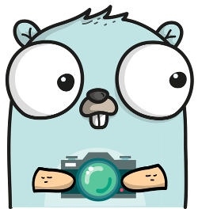
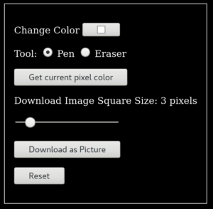

# Download the Picture
This is the sixth post in the PiHatDraw series. In the [previous post](ch4.md), we added colors and user controls to the web application. In this post, we will allow the web client user to download the picture as a PNG image.

## Getting the Code
In this post, we will build the forth phase of the PiDrawHat application. If you like, you can download the code from here: https://github.com/nunnatsa/piHatDraw/releases/tag/v0.0.5

## What are We Going to Build
This time we'll start from the web client code, to add two controls: a pixel size rang slider and the download button. Then we'll add a new request handler to our web application, and add the required code in the controller and the state packages, so the request handler would get the picture information, in order to produce a PNG image.

## Web Client Changes
Let's start from the the we client code. Downloading a file is not something we need to synchronize between the web clients or the HAT display. It is an operation that done from one specific web browser, and the rest of the client should know nothing about it. Open the `webapp/index.gohtml` file, and add the following after the `pickColorFromPixel` button and before the reset button. The code should look like this:
```html
<p>
    <input id="pickColorFromPixel" type="button" value="Get current pixel color">
</p>
<form method="get" action="http://{{.Host}}:{{.Port}}/api/canvas/download">
    <p>
        <label id="pixelSizeRangeLabel" for="pixelSizeRange"></label>
    </p>
    <p>
        <input type="range" name="pixelSize" min="1" max="20" value="3" id="pixelSizeRange" list="tickmarks">
    </p>
    <p>
        <input id="download" type="submit" value="Download as Picture">
    </p>
</form>
<p>
    <input id="reset" type="button" value="Reset">
</p>
```

(Lines 1 -3 and 15 – 17 already exist. The new lines are 4 – 14). We added a new form to the controller. We are going to use the regular form submit so we could practice processing a form in golang. The range controller changes the square size (in pixels) in the image we want to generate. Since it's in the form, the browser will add its value when pressing the submit button. The browser will send a GET HTTP request that will look like this (when the value of the range controller is 3): `http://{{.Host}}:{{.Port}}/api/canvas/download?pixelSize=3`

Next, add above the following code just above the `getCellId` function:
```javascript
const pixelSizeRangeLabel = document.getElementById("pixelSizeRangeLabel")
const pixelSizeRange = document.getElementById("pixelSizeRange")
window.onload = updateRangeLabel
pixelSizeRange.oninput = updateRangeLabel
```
And the updateRangeLabel function below the reverseColor function:
```javascript
function updateRangeLabel() {
    pixelSizeRange.style.width = document.getElementById("main").style.width
    const plural = pixelSizeRange.value === "1" ? "" : "s"
    pixelSizeRangeLabel.innerText = `Download Image Square Size: ${pixelSizeRange.value} pixel${plural}`
}
```
We want to have a visibility of the selected square size, so we are updating the label with the current value of the range slider each time it's changing.

## Backend Changes
Now we want to add a handler to the new request. The design challenge here is that we isolated the state so only the controller got access to it, but we need the state to generate an image file. There are several ways to do that, for example – to add a state pointer to the webapp type, but then we'll create a binding between the webapp and the state and we want to avoid that. The solution we'll use is a bit complex, but it provides two advantages: it's not creating binding, and it prevents the risk of data corruption while generating the image.

Open the `webapp/websocke.go` file and add the following packages to the import block at the top of the file:
```go
"image"
"image/color"
"image/png"
"strconv"
```

Then, below the ClientEventReset type, add a new type:
```go
type ClientEventDownload chan [][]common.Color
```
We added a new client event that is actually a channel of a matrix of colors. This is a callback channel that we'll send to the controller.

Now, add the downloadImage request handler at the end of the file:
```go
unc (ca WebApplication) downloadImage(w http.ResponseWriter, r *http.Request) {
   if r.Method == http.MethodGet {
      r.ParseForm()

      pixelSizeStr := r.Form.Get("pixelSize")
      pixelSize, err := strconv.Atoi(pixelSizeStr)
      if err != nil || pixelSize < 1 || pixelSize > 20 {
         w.Header().Set("Content-Type", "application/json")
         w.WriteHeader(http.StatusBadRequest)
         fmt.Fprintln(w, `{"error": "wrong pixel size"}`)
         return
      }

      canvasChannel := make(chan [][]common.Color)
      ca.clientEvents <- ClientEventDownload(canvasChannel)
      imageData := <-canvasChannel

      imageCanvas, err := getImageCanvas(imageData, pixelSize)
      if err != nil {
         w.Header().Set("Content-Type", "application/json")
         w.WriteHeader(http.StatusInternalServerError)
         fmt.Fprintf(w, `{"error": "%v"}`, err)
         return
      }

      w.Header().Add("Content-Disposition", `attachment; filename="untitled.png"`)
      w.Header().Set("Content-Type", "image/png")

      log.Println("downloading a file; pixel size =", pixelSize)
      png.Encode(w, imageCanvas)

   } else {
      w.WriteHeader(http.StatusMethodNotAllowed)
   }
}
```
First, we make sure this is a GET request, then, we want to get the pixelSize query parameter from the request. To do that, we first need to call the request's ParseForm function, to process the form (line 3). Now we can access the form fields. in lines 5 – 12, we're getting the `pixelSize` query parameter as a string, converting it to an integer, and validating that it is indeed a number and that its value is between 1 and 20 pixels. If the validation fails, we are returning a JSON response with an error. The HTTP status is 400 “Bad Request”, because the input is wrong.

Next, we're creating a channel of a matrix of colors. This is the callback channel – we are sending it as a `ClientEventDownload` event to the controller (lines 15 – 16). In line 17, we are waiting for the controller to send a color matrix using the channel we provided. Until that happens, the request handler goroutine is blocked.

When the color matrix arrived, we can start generating our image. We are calling the getImageCanvas function to generate an image.RGBA instance. This is a generic matrix of pixels that is used to create an image with a specific format (lines 18 – 24).

Next, we're adding two response headers. The `Content-Disposition` with the attachment attribute, notify the web browser that the response body is a content of a file. The `Content-Type` header notifies the response body format – a PNG image in this case.

At the end of the function, we generate the PNG file from the `image.RGBA` we created earlier. Since the `png.Encode` function uses the `io.Writer` interface as a target to write the image to, we can send the response writer w to this function, and it will generate the image as the response body.

Now, add the `getImageCanvas` function:
```go
func getImageCanvas(imageData [][]common.Color, pixelSize int) (*image.RGBA, error) {
   height := len(imageData) * pixelSize
   if height == 0 {
      return nil, fmt.Errorf("can't get the data")
   }

   width := len(imageData[0]) * pixelSize
   if width == 0 {
      return nil, fmt.Errorf("can't get the data")
   }

   img := image.NewRGBA(image.Rect(0, 0, width, height))
   for y, line := range imageData {
      for x, pixel := range line {
         setPixel(img, x, y, toColor(pixel), pixelSize)
      }
   }

   return img, nil
}
```
The function receives two parameters: the original matrix from the application state, and the `pixelSize` we've got from the user in the request. First, we make sure that we got a valid matrix, that is not empty (lines 2 -10), then, we create an image.RGBA with the requested size: the image width is the matrix width multiply by the pixel size, and the image height is the matrix height multiply by the pixel size.

Now, in the nested loops, we are going over the whole matrix and for each pixel in the matrix, we are adding a square to the image, with the size of the `pixelSize` parameter, and the color of the pixel. the `toColor` function translates between our `uint32` color format to the `color.Color` format, used by the `image.RGBA` type.

Now add these two functions at the end of the file:
```go
func setPixel(img *image.RGBA, x int, y int, pixel color.Color, pixelSize int) {
   x = x * pixelSize
   y = y * pixelSize
   for x1 := x; x1 < x+pixelSize; x1++ {
      for y1 := y; y1 < y+pixelSize; y1++ {
         img.Set(x1, y1, pixel)
      }
   }
}

func toColor(pixel common.Color) color.Color {
   r := uint8((pixel >> 16) & 0xFF)
   g := uint8((pixel >> 8) & 0xFF)
   b := uint8(pixel & 0xFF)

   return color.RGBA{A: 0xFF, R: r, G: g, B: b}
}
```
Finally, bind the `downloadImage` request handler to the `/api/canvas/download` path. Add this line to the `NewWebApplication` function, before the return ca line:

```go
mux.HandleFunc("/api/canvas/download", ca.downloadImage)
```

## State Changes
Open the state/state.go file and add this function under the canvas type definition:
```go
func (c canvas) Clone() canvas {
   if len(c) == 0 || len(c[0]) == 0 {
      return nil
   }

   newCanvas := make([][]common.Color, len(c))
   for y, line := range c {
      newCanvas[y] = make([]common.Color, len(line))
      copy(newCanvas[y], line)
   }

   return newCanvas
}
```
The `Clone` a simple function that just creates a copy of the canvas from an existing canvas.

## Controller Changes
Add a new event handler to the switch data := e.(type) block:
```go
case webapp.ClientEventDownload:
   ch := chan [][]common.Color(data)
   ch <- c.state.Canvas.Clone()
```

After the change, the block should look like this:
```go
case e := <-c.clientEvents:
   switch data := e.(type) {
   case webapp.ClientEventRegistered:
      id := uint64(data)
      c.registered(id)

   case webapp.ClientEventReset:
      if data {
         c.state.Reset()
         changed = true
      }

   case webapp.ClientEventSetColor:
      color := common.Color(data)
      changed = c.state.SetColor(color)

   case webapp.ClientEventSetTool:
      switch string(data) {
      case "pen":
         changed = c.state.SetPen()
      case "eraser":
         changed = c.state.SetEraser()
      default:
         log.Printf(`unknown tool "%s"`, data)
      }

   case webapp.ClientEventDownload:
      ch := chan [][]common.Color(data)
      ch <- c.state.Canvas.Clone()
   }
```
The controller, when handling the `ClientEventDownload` event, just uses the new canvas.Clone function to create a copy of the picture pixel matrix, and send it to the callback channel that was sent as the event body. Since we're performing the clone in the controller goroutine, no other event is processed during the cloning, so we can be sure that we don’t end up with a corrupted state – a state that is half modified.

## Summary
In this post, we added an option to download the picture as a PNG file. We added a download button and a slider to the web client. When the user clicks on the download button, the web browser sends a GET HTTP request with the pixelSize query parameter. The request handler handles this request by sending a callback channel to the controller. The controller sends a copy of the canvas back to the request handler in the callback channel. The request handler builds the image matrix and uses the png.Encode function to write the PNG image as the request response.

## Building and Running
To build the piHatDraw application, use the Raspberry pi terminal: from the project directory (e.g. ~/go/src/piHatDraw), use the following command (don’t forget the dot):
```shell
go build .
```
The project directory should now include a new file named piHatDraw with no extension. To run it, just type in the terminal:
```shell
./pyHatDraw
```
If we did everything right, one LED is light in red in the middle of the HAT display – this is the cursor. In addition, you should see a printout in your terminal something like this:
```
In your web browser, go to http://raspberrypi:8080
```
Open the URL from the printout in your browser, in addition to the canvas matrix, you should now see the control panel. In Firefox, it should look like this:



Try to draw something, then click on the `Download as Picture` button to get the picture as an image. Try to download the picture with different square sizes.

In the [next post](ch6.md), we’ll improve the application performance, and add the undo feature.

Image by [Radoan Tanvir](https://pixabay.com/users/radoan_tanvir-866268/?utm_source=link-attribution&utm_medium=referral&utm_campaign=image&utm_content=5971372) from [Pixabay](https://pixabay.com/?utm_source=link-attribution&utm_medium=referral&utm_campaign=image&utm_content=5971372)