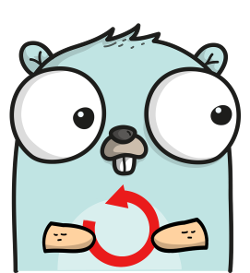

# Chapter 6 – Undo
This is the seventh post in the PiHatDraw series. In the [previous post](ch5.md), we added an option to download the picture as a PNG image. In this post, we will allow the web client user to undo the last operation.

## Getting the Code
In this post, we will build the sixth phase of the PiDrawHat application. If you like, you can download the code from here: https://github.com/nunnatsa/piHatDraw/releases/tag/v0.0.6

## What are We Going to Build
We will start by improving the performance of the current code, by reducing the size of the WebSocket messages, and then use this change to build an undo capability.

Up until now, we sent the full state as a JSON message to the WebSocket clients. That was done for every change in the state: even if we just moved the cursor, or changed the pen color, we sent the whole canvas matrix. The canvas matrix JSON representation is a matrix of HTML color strings, that we converted from our Color type. This conversion is also pricey in terms of performance.

We'll start by changing this. We'll introduce the Change type that will be used to describe the specific change that was made in the application state, and then we can send the JSON representation of the new Change type to the WebSocket clients. That way, we're only processing and sending what we really need.

After doing that, we can use the new Change concept to build a list of changes each time we change the state, so we can undo the last operations. Let's start.

## State Changes
First, we'll create a new type that will be used to create change messages. Add a new change.go file under the state directory, and copy the following code:

```go
package state

import (
   "piHatDraw/common"
)

type Pixel struct {
   X     uint8        `json:"x"`
   Y     uint8        `json:"y"`
   Color common.Color `json:"color"`
}

type Change struct {
   Canvas   *canvas `json:"canvas,omitempty"`
   Cursor   *cursor `json:"cursor,omitempty"`
   Window   *window `json:"window,omitempty"`
   ToolName string  `json:"toolName,omitempty"`
   Pen      *pen    `json:"pen,omitempty"`

   Pixels []Pixel `json:"pixels,omitempty"`
}
```
The new `Pixel` type in lines 7 – 11, represent the status of a single pixel in out picture.

The Change type in lines 13 – 21 is just a data structure with no functions. Notice that all the fields in this type are with omitempty in their JSON tag and that almost all of them are pointers, so their default value is nil. The `ToolName` is a string and the `Pixels` field is an array, so they can also be empty. The meaning is that only what we'll set in the specific instance, will appear in the JSON representation after the encoding.

Now, we'll change `state/state.go` to use the new `Change` type. We will change our state modifying function to return a change instead of a boolean value. If there was no actual change (for example, moving up when the cursor is at the top), these function will return nil.

Since the changes in this file are spread all over the file, just replace it with the following:
```go
package state

import (
   "log"

   "piHatDraw/common"
   "piHatDraw/hat"
)

type canvas [][]common.Color

func (c canvas) Clone() canvas {
   if len(c) == 0 || len(c[0]) == 0 {
      return nil
   }

   newCanvas := make([][]common.Color, len(c))
   for y, line := range c {
      newCanvas[y] = make([]common.Color, len(line))
      copy(newCanvas[y], line)
   }

   return newCanvas
}

type cursor struct {
   X uint8 `json:"x"`
   Y uint8 `json:"y"`
}

type window struct {
   X uint8 `json:"x"`
   Y uint8 `json:"y"`
}

type tool interface {
   GetColor() common.Color
}

type pen struct {
   Color common.Color `json:"color"`
}

func (p pen) GetColor() common.Color {
   return p.Color
}

func (p *pen) SetColor(c common.Color) {
   p.Color = c
}

type Eraser struct{}

func (Eraser) GetColor() common.Color {
   return 0
}

type State struct {
   Canvas       canvas `json:"canvas,omitempty"`
   Cursor       cursor `json:"cursor,omitempty"`
   Window       window `json:"window,omitempty"`
   canvasWidth  uint8
   canvasHeight uint8
   ToolName     string `json:"toolName"`
   Pen          *pen   `json:"pen"`
   tool         tool
}

func NewState(canvasWidth, canvasHeight uint8) *State {
   s := &State{
      canvasWidth:  canvasWidth,
      canvasHeight: canvasHeight,
   }

   _ = s.Reset()

   return s
}

func (s *State) Reset() *Change {
   c := make([][]common.Color, s.canvasHeight)
   for y := uint8(0); y < s.canvasHeight; y++ {
      c[y] = make([]common.Color, s.canvasWidth)
   }

   cr := cursor{X: s.canvasWidth / 2, Y: s.canvasHeight / 2}
   halfWindow := uint8(common.WindowSize / 2)
   win := window{X: cr.X - halfWindow, Y: cr.Y - halfWindow}

   s.Canvas = c
   s.Cursor = cr
   s.Window = win
   s.Pen = &pen{Color: 0xFFFFFF}
   s.SetPen()

   return s.GetFullChange()
}

func (s *State) GoUp() *Change {
   if s.Cursor.Y > 0 {
      s.Cursor.Y--
      if s.Cursor.Y < s.Window.Y {
         s.Window.Y = s.Cursor.Y
      }
      return s.getPositionChange()
   }
   return nil
}

func (s *State) GoLeft() *Change {
   if s.Cursor.X > 0 {
      s.Cursor.X--
      if s.Cursor.X < s.Window.X {
         s.Window.X = s.Cursor.X
      }
      return s.getPositionChange()
   }
   return nil
}

func (s *State) GoDown() *Change {
   if s.Cursor.Y < s.canvasHeight-1 {
      s.Cursor.Y++
      if s.Cursor.Y > s.Window.Y+common.WindowSize-1 {
         s.Window.Y++
      }
      return s.getPositionChange()
   }

   return nil
}

func (s *State) GoRight() *Change {
   if s.Cursor.X < s.canvasWidth-1 {
      s.Cursor.X++
      if s.Cursor.X > s.Window.X+common.WindowSize-1 {
         s.Window.X++
      }
      return s.getPositionChange()
   }

   return nil
}

func (s *State) PaintPixel() *Change {
   if s.Cursor.Y >= s.canvasHeight || s.Cursor.X >= s.canvasWidth {
      log.Printf("Error: Cursor (%d, %d) is out of canvas\n", s.Cursor.X, s.Cursor.Y)
      return nil
   }

   c := s.tool.GetColor()
   if s.Canvas[s.Cursor.Y][s.Cursor.X] != c {
      s.Canvas[s.Cursor.Y][s.Cursor.X] = c
      return &Change{
         Pixels: []Pixel{{
            X:     s.Cursor.X,
            Y:     s.Cursor.Y,
            Color: c,
         }},
      }
   }

   return nil
}

func (s State) CreateDisplayMessage() hat.DisplayMessage {
   c := make([][]common.Color, common.WindowSize)
   for y := uint8(0); y < common.WindowSize; y++ {
      c[y] = make([]common.Color, 0, common.WindowSize)
      c[y] = append(c[y], s.Canvas[s.Window.Y+y][s.Window.X:s.Window.X+common.WindowSize]...)
   }

   return hat.NewDisplayMessage(c, s.Cursor.X-s.Window.X, s.Cursor.Y-s.Window.Y)
}

func (s *State) SetColor(cl common.Color) *Change {
   if s.Pen.GetColor() != cl {
      s.Pen.SetColor(cl)
      return &Change{
         Pen: &pen{
            Color: cl,
         },
      }
   }
   return nil
}

const (
   penName    = "pen"
   eraserName = "eraser"
)

func (s *State) SetPen() *Change {
   s.tool = s.Pen
   if s.ToolName != penName {
      s.ToolName = penName
      return &Change{
         ToolName: penName,
      }
   }
   return nil
}

var eraser Eraser

func (s *State) SetEraser() *Change {
   if s.ToolName != eraserName {
      s.ToolName = eraserName
      s.tool = eraser
      return &Change{
         ToolName: eraserName,
      }
   }
   return nil
}

func (s State) getPositionChange() *Change {
   return &Change{
      Cursor: &cursor{
         X: s.Cursor.X,
         Y: s.Cursor.Y,
      },
      Window: &window{
         X: s.Window.X,
         Y: s.Window.Y,
      },
   }
}

func (s State) GetFullChange() *Change {
   cv := s.Canvas.Clone()
   return &Change{
      Canvas:   &cv,
      Cursor:   &s.Cursor,
      Window:   &s.Window,
      ToolName: s.ToolName,
      Pen:      s.Pen,
   }
}
```
We added two new helper function: `getPositionChange` (lines 217 – 228) and `GetFullChange` (lines 230 – 239). The `getPositionChange` function creates a change with only cursor and window positions. The `GetFullChange` function creates a full change, where all the fields are getting values.

The `Reset` function is now returning a pointer to Change and uses the `GetFullChange` function to create it (line 96). The moving function (`GoUp`, `GoLeft`, `GoDown` and `GoRight`) also returns a pointer to `Change`. They all use the `getPositionChange` function to create the change. Notice that if there is no actual change, the moving functions return nil, for example, in `GoUp`, if the cursor is on the top of the picture (Y == 0).

The `PaintPixel` function (line 145), also creates a `Change` but this time, it creates it with a slice of Pixel items, that contains one Pixel. The Pixel type contains a position (X and Y) and a Color, so it represents one pixel in the picture. The Change type contains a slice of Pixel. This is a preparation to the next chapter, and currently, we'll only produce one-pixel change.

The same is done for the `SetColor`, `SetPen` and `SetEraser` functions.

## Controller Changes
In the controller, we need to change the do function to get a Change value instead of a Boolean function. Open the `controller/controller.go` file and replace the current do function with this one:

```go
func (c *Controller) do() {
   // Set up a signals channel (stop the loop using Ctrl-C)
   signals := make(chan os.Signal, 1)
   signal.Notify(signals, os.Interrupt, syscall.SIGTERM)

   defer c.stop(signals)

   c.hat.Start()

   msg := c.state.CreateDisplayMessage()
   c.screenEvents <- msg

   for {
      var change *state.Change = nil

      select {
      case <-signals:
         return

      case je := <-c.joystickEvents:
         switch je {
         case hat.MoveUp:
            change = c.state.GoUp()

         case hat.MoveLeft:
            change = c.state.GoLeft()

         case hat.MoveDown:
            change = c.state.GoDown()

         case hat.MoveRight:
            change = c.state.GoRight()

         case hat.Pressed:
            change = c.state.PaintPixel()
         }

      case e := <-c.clientEvents:
         switch data := e.(type) {
         case webapp.ClientEventRegistered:
            id := uint64(data)
            c.registered(id)

         case webapp.ClientEventReset:
            if data {
               change = c.state.Reset()
            }

         case webapp.ClientEventSetColor:
            color := common.Color(data)
            change = c.state.SetColor(color)

         case webapp.ClientEventSetTool:
            switch string(data) {
            case "pen":
               change = c.state.SetPen()
            case "eraser":
               change = c.state.SetEraser()
            default:
               log.Printf(`unknown tool "%s"`, data)
            }

         case webapp.ClientEventDownload:
            ch := chan [][]common.Color(data)
            ch <- c.state.Canvas.Clone()
         }
      }

      if change != nil {
         c.Update(change)
      }
   }
}
```
Now, in the `Update` function, instead of creating a JSON representation of the whole state, we're doing it only for the change, and since all its fields are optional, we'll receive very short JSON content.

Here is the new version of the `Update` function:
```go
func (c *Controller) Update(change *state.Change) {
   msg := c.state.CreateDisplayMessage()
   go func() {
      c.screenEvents <- msg
   }()

   js, err := json.Marshal(change)
   if err != nil {
      log.Println(err)
   } else {
      c.notifier.NotifyAll(js)
   }
}
```
There are only two changes in the function: its signature, which now receives a pointer to `Change`, and in line 7, we're marshaling the change instead of the whole state.

The last change in the `controller` package is in the `registered` function. It was changed to produce a full change when a new web client is registered, so the new web client will receive the full state because new clients do not have a reference to apply the changes.
```go
func (c *Controller) registered(id uint64) {
   change := c.state.GetFullChange()
   js, err := json.Marshal(change)
   if err != nil {
      log.Println(err)
   } else {
      c.notifier.NotifyOne(id, js)
   }
}
```
Instead of marshaling the state itself, we're using the `state.GetFullChange` function to get a full Change, and then marshaling this change.

## Web Application Changes
Notice that the sending of the messages to the WebSocket client was not changed at all. The WebSocket channel keeps receiving byte slices as messages. Only the content of these messages was changed, but not their type.

We need to change the web client code to have a local state and to adopt and implement the change messages, rather than receiving the whole application state in each message.

Open the `webapp/index.gohtml` file. Add the following new variables in the second `<script>` tag, just under the `cursorID` variable:
```javascript
let canvas
let tool
let color
let win
```

These variables, together with the `cursorID` variable, are the local state. The canvas variable holds the picture matrix of pixels, the tool variable holds the tool name, color holds the pen color and win holds the window location (the Sense HAT LED display position in the picture).

Now, replace the signature of the `markWindowBorders` function to:
```javascript
function markWindowBorders(i, j, td)
```

We just removed the win parameter from the function, causing the function code to use our new win global variable instead of the local one.

Next, change the implementation of the `socket.onmessage` event with the new version of the function:
```javascript
socket.onmessage = function (e) {
    const data = JSON.parse(e.data)

    console.log(`Received new webSocket message: ${e.data}`)
    if ( data.canvas ) {
        canvas = data.canvas
    }

    if ( data.pixels && canvas ) {
        for ( let pixel of data.pixels ) {
            canvas[pixel.y][pixel.x] = pixel.color
        }
    }

    if ( data.window ) {
        win = data.window
    }

    if ( data.pen ) {
        color = data.pen.color
    }

    const mt = document.getElementById("matrix")
    while (mt.lastElementChild) {
        mt.removeChild(mt.lastElementChild);
    }

    if ( data.cursor ) {
        cursorID = getCelId(data.cursor.x, data.cursor.y)
    }

    if ( data.toolName ) {
        tool = data.toolName
    }

    for ( let i = 0; i < canvas.length; i++ ) {
        let line = canvas[i]
        let tr = document.createElement("tr")
        for (let j = 0; j < line.length; j++) {
            let cell = line[j]
            let td = document.createElement("td")
            td.id = getCelId(j, i)
            td.style.backgroundColor = cell

            markWindowBorders(i, j, td);

            tr.appendChild(td)
        }
        mt.appendChild(tr)
    }

    const cursorElement = document.getElementById(cursorID)
    cursorElement.style.color = reverseColor(cursorElement.style.backgroundColor)
    cursorElement.innerText = tool === "pen" ? '+' : tool === "eraser" ? 'x' : "?"

    if ( tool === "pen" ) {
        toolTypePen.checked = "checked"
    } else if ( tool === "eraser" ) {
        toolTypeEraser.checked = "checked"
    }

    colorPicker.value = color
}
```
First, we are collecting the message components into our local state variables. This is done in lines 5 – 34. For we are only consuming the data that actually received in the message. The rest of the local state is kept from previous messages. Notice that in lines 9 – 13 we are doing something different: if we've got a pixel array in the message, we are updating the canvas local state with these pixels.

Then, in lines 36 – 62, we're doing the same as we did in the previous version of this function, but instead of taking the data from the message, we're taking it from the local state variables. So we re-drawing the HTML document for each change, but we don't need the whole information to be sent each time, because we already holding it.

Let's give it a try. build and run the application. In the raspberry pi terminal, go to our code directory and run:
```shell
go build .
./piHatDraw
```
Open your web browser and go to the page printed by the application. Play with the Sense HAT joystick and the web-client controls. If we did everything correctly, everything should work as before. open the developer view in your web browser (in Firefox and chrome, press F12) and go to the console view. notice that the messages now only contain the actual change and not the whole state.

Now, we'll use the the small changes concept to implement undo mechanism.

## Implementing the Undo Mechanism
We want to implement undo mechanism. We want that when the user will press the undo button, we will cancel the latest operation and restore the previous state. Then, if the user press the undo button again, we will undo the operation we did before the latest one, and so on. This is a "last in first out" (LIFO) behavior. Usually, to implement a LIFO behavior, we need a LIFO data structure – a stack. A stack is a list of items. But we can only add items or remove items from the top of the list, so the last item we insert (push), is the first item we take of the list (pop).

A simple way to implement a stack is using a linked list. In a linked list we have a list of nodes. Each node contains the actual data, and a pointer to the next node in the list. The linked list type will contain a head pointer to point on the first node in the list.

Let's start. Open the `state/change.go` file, and add the changeNode type at the bottom of the file:
```go
type changeNode struct {
   data *Change
   next *changeNode
}
```
The `changeNode` is a linked list node. Its data is a pointer to a `Change` and its next field points to another node.

Now, let's add the list type:
```go
type changeStack struct {
   head *changeNode
}
```
The `changeStack` type contains only one field – the head field that points to the first item on the list.

Now, we'll add the `changeStack.push` function. This function adds a new Change item to the top of the stack.
```go
func (s *changeStack) push(change *Change) {
   s.head = &changeNode{
      data: change,
      next: s.head,
   }
}
```
The `push` function receives a pointer to `Change`. This is our data type. we are now updating the head to point to a new node. The node's data is what we've got as a parameter, and the next field is what used to be the head. If the list is empty, the head was nil, so now it points to the first and only node, and the node's next field is the old value of the head – nil, that indicates the end of the list. If the stack is not empty, the head was pointing to the first node in the list, so now, the new node's next field points to this node, and the head points to the new node, so it became the first node and the list is still connected and wasn't broken.

Next, we'll implement the `pop` function, to remove the first node from the list. Pulling is a bit more tricky, and we need to make take care of two edge cases: when the stack is empty, and when the stack holds only one node.
```go
func (s *changeStack) pop() *Change {
   if s == nil || s.head == nil {
      return nil
   }
   res := s.head
   s.head = s.head.next

   if res == nil {
      return nil
   }

   return res.data
}
```
We need to decide what to do in the case where the stack is empty. In our implementation, we don't want to trigger an error, because we can just ignore it – a nil Change is ignored by the controller. So we'll return nil if the stack is empty. The stack is empty if it or its head field are nil (lines 2 -4).

Then, we temporarily store the change address in the res variable, so we won't lose it (line 5). In line 6, we are updating the stack head to the head‘s next field. The `head.next` field is pointing to the second node in the list, that as a result of this change, became the first one. If the stack was only with one node, the new value of the head field is now nil because the last node always points to nil in its next field. The stack is now up-to-date now – we successfully removed the first node. We're using the res variable, that points to the removed node, to return its data field as the function return value.

The last thing we'll do in this file is to add the `undoList` package private variable, to be our undo stack implementation. This variable can only be access from the state package.
```go
var undoList = &changeStack{
    head: nil,
}
```
Now, let's use our new stack to implement undo mechanism. First, we want to decide what do we want to allow to undo. This is not a technical question but a "business" decision – what do we want from the application – what the requested behavior. What we're going to implement is only allow undoing operations that actually modified the picture. Moving, changing tools and color, and so on, all can be easily done by the user from the Sense HAT joystick or from the web client controls. The only operations that change the picture are: paint a pixel, delete a pixel and reset the picture. Both painting and deleting a pixel are done in the same function – PaintPixel. Open the state/state.go file and edit the PaintPixel function:
```go
func (s *State) PaintPixel() *Change {
   if s.Cursor.Y >= s.canvasHeight || s.Cursor.X >= s.canvasWidth {
      log.Printf("Error: Cursor (%d, %d) is out of canvas\n", s.Cursor.X, s.Cursor.Y)
      return nil
   }

   c := s.tool.GetColor()
   if s.Canvas[s.Cursor.Y][s.Cursor.X] != c {
      chng := &Change{
         Pixels: []Pixel{{X: s.Cursor.X, Y: s.Cursor.Y, Color: s.Canvas[s.Cursor.Y][s.Cursor.X]}},
      }
      undoList.push(chng)
      s.Canvas[s.Cursor.Y][s.Cursor.X] = c
      return &Change{
         Pixels: []Pixel{{
            X:     s.Cursor.X,
            Y:     s.Cursor.Y,
            Color: c,
         }},
      }
   }

   return nil
}
```
We are only adding lines 9 – 12. We're building a new Change slice with one item. This Change item is with the same location (same x and y) as the pixel we're about to paint, but the color is the color that is the current color, before the change. The meaning is that this is applying this change will restore the original color in the same location. In line 12, we're pushing the change to the undoList stack.

The other function that modifies the picture is the Reset function. Add the following code at the very beginning of the Reset function. Keep the rest of the function as is.

```go
if len(s.Canvas) > 0 {
   cv := s.Canvas.Clone()
   chng := &Change{
      Canvas: &cv,
   }

   undoList.push(chng)
}
```
Since we are using the `Reset` function also to initiate a new state when the application starts, we must first check that the state exists. Then we clone it into a new Change and pushing it to the `undoList` stack. So this change actually contains the original full picture, and applying it will restore the picture to its original state before the reset.

Now, let's implement the undo itself. Add the new `Undo` function:
```go
func (s *State) Undo() *Change {
   chng := undoList.pop()
   if chng != nil {
      if chng.Canvas != nil {
         s.Canvas = *chng.Canvas
      } else if len(chng.Pixels) > 0 {
         for _, pixel := range chng.Pixels {
            s.Canvas[pixel.Y][pixel.X] = pixel.Color
         }
      }
   }

   return chng
}
```
We'll see later that for the controller, it's just a regular change in the application state. We have two kinds of changes that we pushed to the `undoList` stack – full canvas restore and pixel slice restore. In lines 4 – 5 we're handling the full canvas restore by replacing the current canvas with the one from the stack. So even if we accidentally clicked on the Reset button, we can still get the picture by undoing the reset operation. In lines 6-9, we're restoring a pixel paint operation. We're going over the list of the modified pixel from the stack – remember that we pushed it with the same location but with the original color, so now we're setting the original color for each modified pixel.

Notice that the function returns the Change from the stack "as-is".

## Web Application Changes
We need to add the Undo button, undo request handler and a matching web client event. It will be very similar to the reset implementation because we need no additional information. First, in the `webapp/index.gohtml` file, just after the download image form, and before the reset button, add the Undo button:
```html
<p>
    <input id="undo" type="button" value="Undo">
</p>
```
Then, add an event handler in the `<script>` tag. I placed it just after the reset event handling function:
```javascript
const undoButton = document.getElementById("undo")
undoButton.onclick = function (e) {
    $.post(
        "http://{{.Host}}:{{.Port}}/api/canvas/undo",
        data = `{"undo": true}`,
        dataType = "json"
    )
}
```

Now, open the `webapp/websocket.go` file. Add the `ClientEventUndo` type just below the `ClientEventDownload`:
```go
type ClientEventUndo bool
```
Add the undo request handler just below the `downloadImage` function:
```go
type undoRq struct {
   Undo bool `json:"undo"`
}

func (ca WebApplication) undo(w http.ResponseWriter, r *http.Request) {
   if r.Method == http.MethodPost {
      enc := json.NewDecoder(r.Body)
      msg := &undoRq{}
      err := enc.Decode(msg)
      if err != nil {
         w.WriteHeader(http.StatusBadRequest)
         fmt.Fprint(w, `{"error": "can't undo'"}`)
         return
      }

      if msg.Undo {
         log.Printf("Got undo request")
      }

      clientEvent := ClientEventUndo(true)
      ca.clientEvents <- clientEvent
   } else {
      w.WriteHeader(http.StatusMethodNotAllowed)
   }
}
```
And finally, bind the undo request handler to the undo path: add the following line in the `NewWebApplication` function, after the downloadImage line:
```go
mux.HandleFunc("/api/canvas/undo", ca.undo)
```
Nothing new here. This is what we did for the Reset button, and the result of the Undo request, is that we're sending the `ClientEventUndo` event to the controller.

## Controller Changes
The last part is to add a web-client event handling in the controller, for the new `ClientEventUndo` event. Open the `operator/operator.go` file and add the following code, as the last case of `switch data := e.(type)`:

```go
case webapp.ClientEventUndo:
   change = c.state.Undo()
```
Since the `state.Undo` function returns a Change, there is nothing left to do. We already saw the actual implementation in the state package.

## Building and Running
Build the application as we did on the previous page, and run it. Open the web client in a web browser. If we did everything right, then you should see the new Undo button. Try to paint some pixels and press the new Undo button. The pixels should be cleared by a reverse order to the painting order. 

Try to change a color of an already set pixel, undo and notice that the pixel is now with the original color. Notice that moving the cursor, changing the color or the tool are not affected by the Undo button. Finally, reset the picture and undo it, and see that the picture is restored.

## Summary
We started this post by refactoring the application to reduce the size of the WebSocket messages by using the new Change type with optional fields. This change kept the application behavior as it was before, but with better performance. Then, we used the new Change type to create undo mechanism, using a linked-list stack. In the [next post](ch7.md), we'll add a new drawing tool – the bucket.

