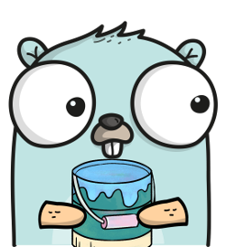

# Chapter 7 – The Bucket Tool
This is the eighth post in the PiHatDraw series. In the [previous post](ch6.md), we added the undo mechanism. In this post, we're going to implement the bucket tool. A bucket in drawing applications is a tool that paints areas, according to their original color.

## Getting the Code
In this post, we will build the eighth phase of the PiDrawHat application. If you like, you can download the code from here: https://github.com/nunnatsa/piHatDraw/releases/tag/v0.0.7

## What are We Going to Build
Up until now, we had two tools – the pen and the eraser. Both of them only pain a single pixel, and so we wrote PaintPixel function in the state package, that uses an interface to get the required color. The pen tool returns the current color and the eraser always returns black. Now we want to have a tool that changes the color of multiple pixels, so the current design does not serve us anymore, and we need to refactor the code – to change the implementation of painting a pixel and changing the selected tool.

The bucket tool implements the Flood Fill algorithm. It takes the color of the selected pixel (defined by the value of the cursor) and paints all the pixels with the same color that are one of these pixel neighbors. Neighbors are the pixels above, below, left, and right to the selected pixel. Then we continue with the neighbors and checking their neighbors and so on. We stop when the neighbor is not of the same color, or if we reached one of the picture boundaries.

Most of the work will be in the state package, to perform the refactoring, and to implement the bucket tool. We'll need to do some tiny changes in the controller package, and to add the bucket tool option in the web client.

## Refactoring the state Package
As I explained above, the tool interface does not fit for tools that are changing multiple pixels. Instead, we will a basic state machine: we will hold a new function field for the tool and will replace the value of this field with the selected tool implementation function. The tool implementation functions get nothing as a parameter and return a pointer to Change. We can still find common steps that are done anyway, so we'll add some common helper functions to be used by the tool implementations. For example, changing the color of a pixel requires a Change object, and also an undo Change. The code of the pen is almost identical to the eraser, except for the color been used to paint the pixel.

Since we get rid of the tool interface and its implementations, we don't have a pen anymore. In addition, placing the `color` within the pen type does not serve us anymore, because other tools need it as well – the new bucket tool for example. So we'll move the color to be a field in the State type itself.

When we started to use the `Change` type in order to create JSON messages, we don't use the `State` for that anymore, so we don't need to expose the `State` fields anymore, and we can hide them and make sure that all the state manipulations are done in the state package.

Here is the new state/state.go file. replace your file with the new one:
```go
package state

import (
    "fmt"
    "log"

    "github.com/nunnatsa/piHatDraw/common"
    "github.com/nunnatsa/piHatDraw/hat"
)

const (
    penName    = "pen"
    eraserName = "eraser"
    bucketName = "bucket"
)

const (
    wightColor      = common.Color(0xFFFFFF)
    blackColor      = common.Color(0)
    backgroundColor = blackColor
)

type Canvas [][]common.Color

func (c Canvas) Clone() Canvas {
    if len(c) == 0 || len(c[0]) == 0 {
        return nil
    }

    newCanvas := make([][]common.Color, len(c))
    for y, line := range c {
        newCanvas[y] = make([]common.Color, len(line))
        copy(newCanvas[y], line)
    }

    return newCanvas
}

type cursor struct {
    X uint8 `json:"x"`
    Y uint8 `json:"y"`
}

type window struct {
    X uint8 `json:"x"`
    Y uint8 `json:"y"`
}

type tool func() *Change

type State struct {
    canvas       Canvas
    cursor       cursor
    window       window
    canvasWidth  uint8
    canvasHeight uint8
    toolName     string
    tool         tool
    color        common.Color
}

func NewState(canvasWidth, canvasHeight uint8) *State {
    s := &State{
        canvasWidth:  canvasWidth,
        canvasHeight: canvasHeight,
    }

    _ = s.Reset()

    return s
}

func (s State) GetCanvasClone() Canvas {
    return s.canvas.Clone()
}

func (s *State) Reset() *Change {
    if len(s.canvas) > 0 {
        chng := &Change{
            Canvas: s.canvas.Clone(),
        }

        undoList.push(chng)
    }

    c := make([][]common.Color, s.canvasHeight)
    for y := uint8(0); y < s.canvasHeight; y++ {
        c[y] = make([]common.Color, s.canvasWidth)
    }

    cr := cursor{X: s.canvasWidth / 2, Y: s.canvasHeight / 2}
    halfWindow := uint8(common.WindowSize / 2)
    win := window{X: cr.X - halfWindow, Y: cr.Y - halfWindow}

    s.canvas = c
    s.cursor = cr
    s.window = win
    s.color = wightColor
    _, _ = s.SetTool(penName)

    return s.GetFullChange()
}

func (s *State) GoUp() *Change {
    if s.cursor.Y > 0 {
        s.cursor.Y--
        if s.cursor.Y < s.window.Y {
            s.window.Y = s.cursor.Y
        }
        return s.getPositionChange()
    }
    return nil
}

func (s *State) GoLeft() *Change {
    if s.cursor.X > 0 {
        s.cursor.X--
        if s.cursor.X < s.window.X {
            s.window.X = s.cursor.X
        }
        return s.getPositionChange()
    }
    return nil
}

func (s *State) GoDown() *Change {
    if s.cursor.Y < s.canvasHeight-1 {
        s.cursor.Y++
        if s.cursor.Y > s.window.Y+common.WindowSize-1 {
            s.window.Y++
        }
        return s.getPositionChange()
    }

    return nil
}

func (s *State) GoRight() *Change {
    if s.cursor.X < s.canvasWidth-1 {
        s.cursor.X++
        if s.cursor.X > s.window.X+common.WindowSize-1 {
            s.window.X++
        }
        return s.getPositionChange()
    }

    return nil
}

func (s *State) Paint() *Change {
    return s.tool()
}

func (s *State) setSinglePixelTool(color common.Color) *Change {
    after, before := s.paintPixel(color, s.cursor.X, s.cursor.Y)
    if after == nil {
        return nil
    }

    if before != nil {
        change := &Change{
            Pixels: []Pixel{*before},
        }
        undoList.push(change)
    }

    return &Change{
        Pixels: []Pixel{*after},
    }
}

func (s *State) pen() *Change {
    return s.setSinglePixelTool(s.color)
}

func (s *State) eraser() *Change {
    return s.setSinglePixelTool(backgroundColor)
}

func (s State) getNeighbors(center Pixel) []Pixel {
    color := center.Color
    res := make([]Pixel, 0, 4)
    if center.Y > 0 && color == s.canvas[center.Y-1][center.X] {
        res = append(res, Pixel{X: center.X, Y: center.Y - 1, Color: color})
    }

    if center.X > 0 && color == s.canvas[center.Y][center.X-1] {
        res = append(res, Pixel{X: center.X - 1, Y: center.Y, Color: color})
    }

    if center.Y < s.canvasHeight-1 && color == s.canvas[center.Y+1][center.X] {
        res = append(res, Pixel{X: center.X, Y: center.Y + 1, Color: color})
    }

    if center.X < s.canvasWidth-1 && color == s.canvas[center.Y][center.X+1] {
        res = append(res, Pixel{X: center.X + 1, Y: center.Y, Color: color})
    }

    return res
}

func (s *State) paintNeighbors(px Pixel, after *[]Pixel, before *[]Pixel) {
    nbs := s.getNeighbors(px)

    afterPx, beforePx := s.paintPixel(s.color, px.X, px.Y)
    if afterPx != nil {
        *after = append(*after, *afterPx)

        if beforePx != nil {
            *before = append(*before, *beforePx)
        }

        for _, n := range nbs {
            s.paintNeighbors(n, after, before)
        }
    }
}

func (s *State) bucket() *Change {
    cursorPx := Pixel{
        X:     s.cursor.X,
        Y:     s.cursor.Y,
        Color: s.canvas[s.cursor.Y][s.cursor.X],
    }

    after := make([]Pixel, 0, 10)
    before := make([]Pixel, 0, 10)

    s.paintNeighbors(cursorPx, &after, &before)
    if len(after) > 0 {
        undoChange := &Change{
            Pixels: before,
        }

        undoList.push(undoChange)

        return &Change{
            Pixels: after,
        }
    }

    return nil
}

func (s *State) paintPixel(color common.Color, x, y uint8) (*Pixel, *Pixel) {
    if y >= s.canvasHeight || x >= s.canvasWidth {
        log.Printf("Error: Cursor (%d, %d) is out of canvas\n", x, y)
        return nil, nil
    }

    if s.canvas[y][x] != color {
        before := &Pixel{
            X:     x,
            Y:     y,
            Color: s.canvas[y][x],
        }

        s.canvas[y][x] = color
        after := &Pixel{
            X:     x,
            Y:     y,
            Color: color,
        }

        return after, before
    }

    return nil, nil
}

func (s State) CreateDisplayMessage() hat.DisplayMessage {
    c := make([][]common.Color, common.WindowSize)
    for y := uint8(0); y < common.WindowSize; y++ {
        c[y] = make([]common.Color, 0, common.WindowSize)
        c[y] = append(c[y], s.canvas[s.window.Y+y][s.window.X:s.window.X+common.WindowSize]...)
    }

    return hat.NewDisplayMessage(c, s.cursor.X-s.window.X, s.cursor.Y-s.window.Y)
}

func (s *State) SetColor(cl common.Color) *Change {
    if s.color != cl {
        s.color = cl
        return &Change{
            Color: &cl,
        }
    }
    return nil
}

func (s *State) SetTool(toolName string) (*Change, error) {
    if toolName == s.toolName {
        return nil, nil
    }

    switch toolName {
    case penName:
        s.tool = s.pen
    case eraserName:
        s.tool = s.eraser
    case bucketName:
        s.tool = s.bucket
    default:
        return nil, fmt.Errorf(`unknown tool "%s"`, toolName)
    }

    s.toolName = toolName
    return &Change{
        ToolName: toolName,
    }, nil
}

func (s State) getPositionChange() *Change {
    return &Change{
        Cursor: &cursor{
            X: s.cursor.X,
            Y: s.cursor.Y,
        },
        Window: &window{
            X: s.window.X,
            Y: s.window.Y,
        },
    }
}

func (s State) GetFullChange() *Change {
    return &Change{
        Canvas:   s.canvas.Clone(),
        Cursor:   &s.cursor,
        Window:   &s.window,
        ToolName: s.toolName,
        Color:    &s.color,
    }
}

func (s *State) Undo() *Change {
    chng := undoList.pop()
    if chng != nil {
        if chng.Canvas != nil {
            s.canvas = chng.Canvas
        } else if len(chng.Pixels) > 0 {
            for _, pixel := range chng.Pixels {
                s.canvas[pixel.Y][pixel.X] = pixel.Color
            }
        }
    }

    return chng
}
```
Let's go over the important changes we made in this file.

In line 49, we redefine the tool type. Instead of an interface, it's now a function type – a function that gets no parameter and returns a pointer to Change. In line 58, we added the new tool field to the state type. The type of this field is the tool type. Since functions are first-class citizens in golang, we can have function variables. We're using this feature to implement a basic state machine: each time we need to change the tool, we'll replace the value of the tool field, to be the specific tool implementation function. Then each time we will ask the state to perform a paint operation, we will call the tool field a function, and it will perform the selected tool logic.

In line 59, we have the new color field in the state type. That used to be in the pen type that we dropped. Notice that now the state fields are all starting with lower letters, so they are not exposed. The JSON tags were removed as well.

In line 99 we're populating the tool field with its default value – the pen function, that implements the pen logic.

The SetTool function in line 291 is used to replace the tool. When a new tool is selected, this function replaces the tool field with the tool implementation function. There is another approach that can work here: we could have a map of tool-name to an implementation function, and the execution function will call it using the tool name. Something like this:
```go
s.toolMap := map[string]tool{
   penName:    s.pen,
   eraserName: s.eraser,
   bucketName: s.bucket,
}

...
// executing the selected tool
s.toolMap[toolName]()
```

This is a valid solution and is widely used, but I thought that in this case, the state machine approach is a better choice because the tool changes are not so dynamic, and the selection of the tool is always done before the execution, and usually not changed so frequently. We'll also never add a new tool on runtime. We don't need to find the right map entry if we can know the tool in advance.

Instead, the Paint function in line 150, executes the painting operation of the selected tool. It actually just call the function in the tool field.

## Tool Implementations
Let's start with the paintPixel function in line 245. This function used by all the tool implementations to pains a single pixel. It receives the pixel location (x and y) and the required color. If the function actually changes the color (if it's not already with the requested color), the function returns two Pixel objects: after – the pixel with the new color to be used to create a Change object, and before that is used to create an undo Change object.

The setSinglePixelToo`l function in line 154, is setting a single pixel using the paitPixel function. It creates and returns a Change from the after response and pushes a undo Change from the before response.

The pen function in line 172 and the eraser function in line 176 just use the setSinglePixelTool function – the pen uses it with the state color, and the eraser uses it with black color.

## The Bucket Tool Implementation
The bucket tool implementation is inspired by this blog post: https://algoritmim.co.il/interview-practice/paint-and-fill (Hebrew). It's a recursive algorithm: we're starting from the cursor location and get its neighbors – only if their color is the same as the original color of the pixel we're checking. Then we modify the pixel color to the state's color and then running the same logic for each one of the neighbors. Since we changed the pixel color before we did the recursive call, this pixel will not be found again as a neighbor of other pixels. That way we'll change each pixel only once – this will give us better performance and will keep the `Change.pixels` list in the size that was actually used.

First, look at the `bucket` function in line 219. This is the bucket tool implementation function. We are starting from the pixel in the cursor location, and use it as a parameter to the `paintNeighbors` recursive function. we're sending the two slices of Pixel, after – to get the change, and before, to get the undo change. If there was a change, we are building an undo change from the before response and push it to the undo stack. Then we're building a Change form the after response and returning it.

The `paintNeighbors` function in line 202 is a recursive function. we're starting by collecting the current pixel's neighbors. Then we're using the `paintPixel` function to try painting the pixel. The `paintPixel` returns nil if the pixel is already painted with the required color. We're checking the response, and if it's nil, we can stop the recursion. This is also an additional validation that prevents setting the same pixel more than once. after collecting the after and before Pixels to the after and before lists, we can loop over the neighbors and run the same function, the `paintNeighbors` function, for each one of them.

The `getNeighbors` function in line 180, is pretty straight forward. It checks for each one of the four directions, if it is in the original color as the first pixel, and if we are still within the picture. If the pixel was already painted with the new color, or if it originally with another color, it won't be picked to the neighbor list. Eventually, down the road of the recursive calls, this function will return an empty list, and that will stop the recursion for this call.

The last change is the addition of the `GetCanvasClone` function in line 73. Since the canvas field is not exposed anymore, we need a proxy function so the controller would be able to get a copy of the canvas.

There are tiny changes in the `staet/change.go` file. In the `Change`, the `Canvas` does not need to be a pointer. So now it's just a `canvas` type. Then we replaced the `Pen` field with the `Color` field. The `Change` type should be like this now:
```go
type Change struct {
   Canvas   Canvas        `json:"canvas,omitempty"`
   Cursor   *cursor       `json:"cursor,omitempty"`
   Window   *window       `json:"window,omitempty"`
   ToolName string        `json:"toolName,omitempty"`
   Color    *common.Color `json:"color,omitempty"`

   Pixels []Pixel `json:"pixels,omitempty"`
}
```
## Controller Changes
Since we are doing refactoring anyway, it is always a good idea to improve the structure of our code. The do function in the `controller/controller.go` is too big. Open this file and add these two new functions. These functions add no new logic, but copy the current subset of the do function:

```go
func (c *Controller) handleWebClientEvent(e webapp.ClientEvent) *state.Change {
   switch data := e.(type) {
   case webapp.ClientEventRegistered:
      id := uint64(data)
      c.registered(id)

   case webapp.ClientEventReset:
      if data {
         return c.state.Reset()
      }

   case webapp.ClientEventSetColor:
      color := common.Color(data)
      return c.state.SetColor(color)

   case webapp.ClientEventSetTool:
      var err error
      change, err := c.state.SetTool(string(data))
      if err != nil {
         log.Printf(err.Error())
         return nil
      }
      return change

   case webapp.ClientEventDownload:
      ch := chan [][]common.Color(data)
      ch <- c.state.GetCanvasClone()

   case webapp.ClientEventUndo:
      return c.state.Undo()
   }

   return nil
}

func (c *Controller) handleJoystickEvent(je hat.Event) *state.Change {
   switch je {
   case hat.MoveUp:
      return c.state.GoUp()

   case hat.MoveLeft:
      return c.state.GoLeft()

   case hat.MoveDown:
      return c.state.GoDown()

   case hat.MoveRight:
      return c.state.GoRight()

   case hat.Pressed:
      return c.state.Paint()
   }
   return nil
}
```
Notice that we changed the implementation of the download handling to use the new `state.GetCanvasClone` function, instead of the canvas.Clone function because the canvas field is not accessible. Setting a new tool was also change. We are letting the state package use the tool name to select the tool by calling the state.SetTool function. Now we can make the for-loop in the do function shorter and more simple and readable:
```go
for {
   var change *state.Change = nil

   select {
   case <-signals:
      return

   case je := <-c.joystickEvents:
      change = c.handleJoystickEvent(je)

   case e := <-c.clientEvents:
      change = c.handleWebClientEvent(e)
   }

   if change != nil {
      c.Update(change)
   }
}
```

## Web Client Changes
In the web client, we need to take the color from the WebSocket message's color field, instead of the `pen.color` field. We'll need to add a new tool radio button for the bucket tool, and a related event handling.

Open the webapp/index.html file and search for this code:
```javascript
if (data.pen) {
    color = data.pen.color
}
```
and replace it by this code:
```javascript
if (data.color) {
    color = data.color
}
```

Now, search for the tools radio button group and add the bucket tool. The code should look like this after the change, while the new lines are 6 and 7:
```html
<p>Tool:
    <input type="radio" id="toolTypePen" name="toolType" value=true checked/>
    <label for="toolTypePen">Pen</label>
    <input type="radio" id="toolTypeEraser" name="toolType" value=false/>
    <label for="toolTypeEraser">Eraser</label>
    <input type="radio" id="toolTypeBucket" name="toolType" value=false/>
    <label for="toolTypeBucket">Bucket</label>
</p>
```
Now, we'll change add a new cursor representation for the bucket tool. Replace this line:
```javascript
cursorElement.innerText = tool === "pen" ? '+' : tool === "eraser" ? 'x' : "?"
```

with this code:
```javascript
cursorElement.innerText = function(tool) {
    switch (tool) {
        case "pen":
            return '+'
        case "eraser":
            return 'x'
        case "bucket":
            return 'o'
        default:
            return '?'
    }
}(tool)
```
Just below this code add a new code to select the right radio button according to the selected tool:
```javascript
if (tool === "pen") {
    toolTypePen.checked = "checked"
} else if (tool === "eraser") {
    toolTypeEraser.checked = "checked"
} else if (tool === "bucket") {
    toolTypeBucket.checked = "checked"
}
```
The new lines are 5 and 6.

The last part is to add the event handler for the bucket radio button:

Find this code:
```javascript
const toolTypePen = document.getElementById("toolTypePen")
toolTypePen.onchange = function (e) {
    setTool("pen")
}
const toolTypeEraser = document.getElementById("toolTypeEraser")
toolTypeEraser.onchange = function (e) {
    setTool("eraser")
}
```
and add this code just below:
```javascript
const toolTypeBucket = document.getElementById("toolTypeBucket")
toolTypeBucket.onchange = function (e) {
    setTool("bucket")
}
```
## Building and Running
To build the piHatDraw application, use the Raspberry pi terminal: from the project directory (e.g. ~/go/src/piHatDraw), use the following command (don't forget the dot):
```shell
go build .
```
The project directory should now include a new file named piHatDraw with no extension. To run it, just type in the terminal:
```shell
./pyHatDraw
```
If we did everything right, one LED is light in red in the middle of the HAT display – this is the cursor. In addition, you should see a printout in your terminal something like this:
```shell
In your web browser, go to http://raspberrypi:8080
```
Open the URL from the printout in your browser, in addition to the canvas matrix, you should now see the control panel. In google chrome, it should look like this:


Try to draw a closed shape with the pen tool, then change to the bucket tool, then go to a location within the closed shape and press the joystick, to fill the shape.


## Summary
In this post, we added the bucket tool and implemented it using the Flood Fill algorithm. We had to do some refactoring in our code and completely change the way the application paint a pixel and changes tools.

[Bucket Png vectors by Lovepik.com](https://lovepik.com/images/png-bucket.html)