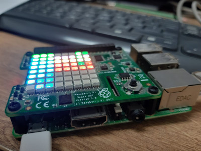
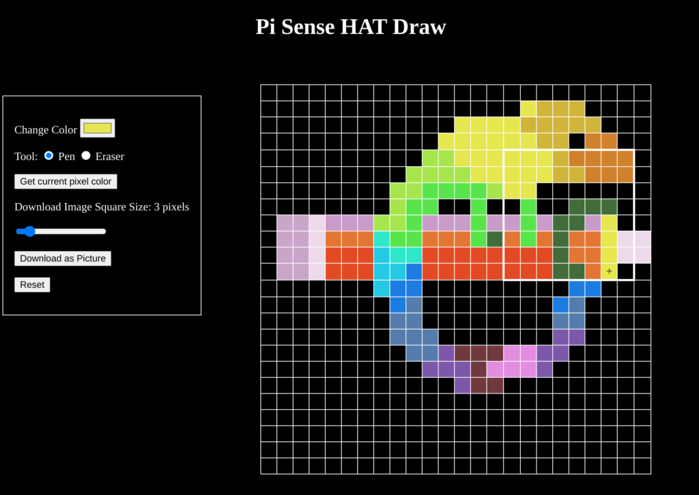

# PiHatDraw — Draw with Raspberry Pi, Sense HAT, golang and WebSockets

PiHatDraw is an application that uses the Sense HAT joystick to draw pictures, and its 8×8 hat display as a floating window, a subset of the full picture. The web display shows the full picture simultaneously and allows changing the pen color, resetting the picture, and even downloading the picture as a PNG image. In this post series, we will build the PiHatDraw application step by step, adding new abilities and practice different golang features.



In this first post, we’ll set up the development environment, then in the coming posts, we’ll build the application. First, we’ll build a simple black and white drawing application that will only use the HAT display for painting. Then we’ll synchronize the draw with a web page. Later, we will resize our canvas beyond the boundaries of the 8×8 HAT LED display. Then, we’ll add colors and control such as reset, delete, and so on, and add the ability to download the picture as an image file. Later, we’ll add the undo feature and the bucket paint tool.

### The github Repository
The source code of the PiHatDraw application is in github. The latest version is in this repository: https://github.com/nunnatsa/piDraw. Fill free to clone or fork this repository.

For this post series, I started to write the application again, in a way that will match the planned posts: I’ll release a new version for each post. The source code for this post series is here: https://github.com/nunnatsa/piHatDraw. Because I’m writing everything again, there will be some small differences between the two applications.

### What I Won’t Cover in this Post Series
I’m not going to explain how to install the Raspberry Pi operation system or the Sense HAT. I am also not going to write about the basics of the go programming language. This not because I don’t want to, but because there are already excellent tutorials on the internet and I don’t have anything to add.

In addition, I wrote unit tests to check the PiHatDraw source code. Unfortunately, the posts are long enough and I can’t really explain them – maybe in the future, in a unit-test dedicated post. However, these tests are available in the git repository and are updated for each post.

## Setup and Preparations
The PiHatDraw is meant to run on a Raspberry Pi, with a Sense HAT, but the Raspberry Pi OS comes with a Sense HAT emulator we can use instead. I tested this code on Raspberry Pi 2B and 3B.

### Installing golang on a Rasberry Pi
The default installation of the go programming language, on a Raspberry Pi is a very old version of golang. For the PiHatDraw, we want to use version 1.16 or newer. While writing this post, the latest version is 1.16.3

In your Raspberry Pi go to the golang download page and select the latest go<version>.linux-armv6l.tar.gz; for example: `go1.16.3.linux-armv6l.tar.gz`.

If you’re working remotely, copy the download link and use the wget command to download; for example:
```shell
wget https://golang.org/dl/go1.16.3.linux-armv6l.tar.gz
```
If you already have an old golang version, remove it:
```shell
rm -rf /usr/local/go
```
Then, from the directory where the downloaded file is located, extract the file:
```shell
tar -C /usr/local -xzf go1.16.3.linux-armv6l.tar.gz
```
Now, add go to your PATH. Edit the $HOME/.profile file with your text editor. Add the following line:
```shell
export PATH=$PATH:/usr/local/go/bin
```
To use the new PATH without logout and in again, use the source command:
```shell
source $HOME/.profile
```
Check your installation by
```shell
go version
```
If everything went well, you will recive a valid printout, like:
```shell
go version go1.16.3 linux/arm
```
### Setup an IDE to work with the Raspberry Pi
It is possible to write code with text editors like vim or nano, but personally, I prefer using an Integrated Development Environment (IDE), like Visual Studio Code. I didn’t test it, but I understand that you’ll need Raspberry Pi 4 in order to run VS code locally on the Raspberry Pi. Instead, we can install the VS code on our computer and connect it to Raspberry Pi using the [Remote – SSH VS Code plugin](https://marketplace.visualstudio.com/items?itemName=ms-vscode-remote.remote-ssh). That will allow you to work with the code that is placed, compiled, and run on the Raspberry Pi, from an IDE from your stronger computer.

## Building and Running the Application
This is the first post of a series of posts. We will build the application step by step during these posts. However, if you want to skip it, a full version of the application may be found in https://github.com/nunnatsa/piDraw. To build and run it in your Raspberry Pi, do the following:

```shell
mkdir -p ~/go/src/github.com/nunnatsa
cd ~/go/src/github.com/nunnatsa
git clone https://github.com/nunnatsa/piDraw.git
cd piDraw
go build .
./piPraw
```
Open a web browser and go to your Raspberry Pi name, on port 8080. The default address (if you didn’t change your Raspberry Pi hostname) is http://raspberrypi:8080